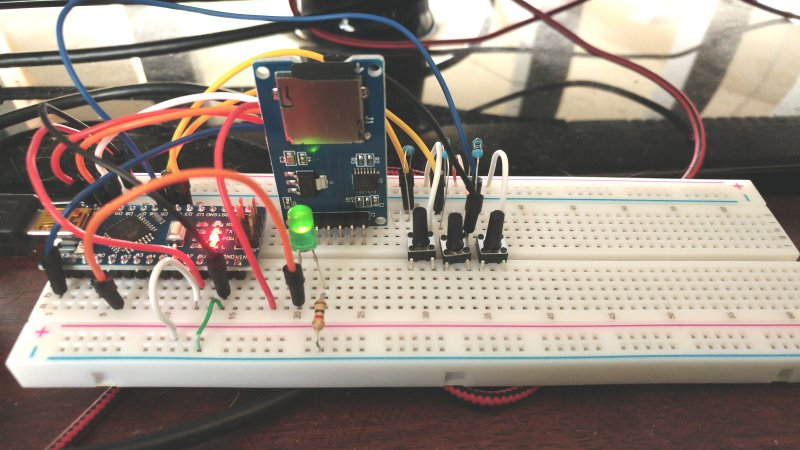

--------------------------------------------------------------------------------
# Altair 101 Software

The core program is the [machine code processor](Processor.ino).
It's written in C, using the Arduino IDE, and is tested on an Arduino Nano microcontroller.
It interprets and processes a subset of the Altair 8800 operational instructions which are Intel 8080 chip opcodes.

The program is able to run 8080 machine code programs using the programmed opcodes.
I will refine the code and increase the opcode functionality.
I'm adding program input functionality via the infrared remote control.
And, adding output via a 1602 LCD.

## The Altair 101 Development Computer

The processor software runs on an Arduino Nano that is on a breadboard with an infrared receiver,  LED lights, and LCD.
The processor program is compiled and uploaded from my laptop to the Nano through a USB cable.
Program log messages are displayed in the Arduino serial monitor that runs on the laptop.

The microcontroller is the Altair 101's CPU and RAM.
The infrared receiver is the computer's keyboard, and LCD is the monitor.



There are a number of online videos showing how an Altair 8800 works.
+ Video showing [startup LED lights](https://www.youtube.com/watch?v=suyiMfzmZKs).
+ Video showing [programming](https://www.youtube.com/watch?v=EV1ki6LiEmg) using the front panel toggles.
+ A jump loop program is entered, examined, stepped through, and run.

I coded the Altair 101 processor program to react the same way.

--------------------------------------------------------------------------------
## 8080 Opcode Development

Opcodes programed and tested:
````
+ cpi #    Compare db with A > compareResult.
+ dad RP   00 RP1 001  Add register pair(RP) to H:L (16 bit add). And set carry bit.
+ hlt      Halt processor
+ in  p    Read input for port a, into A
+ inr R    Increment the register.
+ inx RP   Increment a register pair, a 16 bit increment. Example: H:L.
+ jmp a    Unconditional jump
+ jz  a    If compareResult is true, jump to lb hb.
+ jnc a    Jump if carry bit is 0 (false).
+ ldax RP  Load indirect through BC(RP=00) or DE(RP=01)
+ lxi RP,a Move the lb hb data to the register pair.
+ mvi R,#  Move a number (#), which is the next db, to register RRR.
+ mov D,S  Move register to a register.
+ nop      No operation
+ rlc      Rotate A left. Shift byte left 1 bit.
+ rrc      Rotate A right. Shift byte right 1 bit.
+ xra R    10 101 SSS  Register exclusive OR with register with A.
````
Still to program on the above:
````
+ OUT p    Write A to output port a.
+ inr R    I still need to set flags.
+ lxi      Need to figure out: move the lb hb data, to the stack pointer.
+ rlc      Need to handle carry bit.
+ rrc      Need to handle carry bit.
+ xra      ZSPCA   Stacy, need to set flags.
````
Click [here](http://www.classiccmp.org/dunfield/r/8080.txt) for a listing of the 8080 opcodes.

--------------------------------------------------------------------------------
## Altair 8800 Status Lights

Video showing [status LED light](https://www.youtube.com/watch?v=3_73NwB6toY) functionality.

The following program demonstrates status lights for specific opcodes.
````
Addr HEX     Assembler code  ;Comments
0000         org     0 
0000 3A2000  lda     40Q     ;opcode fetch, memory read x 3 
0003 322100  sta     41Q     ;opcode fetch, mem read x 2, mem write x 1
0006 312000  lxi     sp,40Q  ;opcode fetch, mem read x 2 
0009 F5      push    a       ;opcode fetch, stack write x 2 
000A F1      pop     a       ;opcode fetch, stack read x 2 
000B DB10    in      20Q     ;opcode fetch, mem read, I/O input 
000D D310    out     20Q     ;opcode fetch, mem read, I/O output 
000F FB      ei              ;interrupts enabled
0010 F3      di              ;interrupts disabled
0011 76      hlt             ;halt  
0012         end
````
Assembler code to HEX value to octal values and binary machine code.
````
Line of code  HEX      Octal         Binary machine code
lda  40Q    | 3A2000 | 072 040 000 | 00 111 010 : 00 100 000 : 00 000 000
sta  41Q    | 322100 | 062 041 000 | 00 110 010 : 00 100 001 : 00 000 000
lxi  sp,40Q | 312000 | 061 040 000
push a      | F5     | 365
...
````
The program octal values are used to entry a program using the panel toggles.
````
072 040 000 
062 041 000 
061 040 000
365
361 333 020 323 020 373 
363 166
````

Click [here](https://coderstoolbox.net/number/) for an online HEX, octal, binary converter.

#### About the Arduino Boards

+ Nano [Memory](https://www.arduino.cc/en/tutorial/memory):
````
    FLASH 32k bytes (of which .5k is used for the bootloader),
    SRAM   2k bytes,
    EEPROM 1k byte
````
+ If you don't need to modify the strings or data while your sketch is running,
    you can store them in flash (program) memory instead of SRAM;
    to do this, use the [PROGMEM](https://www.arduino.cc/reference/en/language/variables/utilities/progmem/) keyword.
+ The ATmega2560 in the Mega2560 has larger memory space:
````
    FLASH  256k bytes (of which 8k is used for the bootloader)
    SRAM   8k bytes
    EEPROM 4k byte
````
+ Even Serial.print messages are stored in SRAM.
    Example: Serial.print(" > JMP, get address low and high order bytes.");

Use "F" in Serial.print messages to have the string message stored in FLASH memory
````
Without "F".
Global variables use 1681 bytes (82%) of dynamic memory, leaving  367 bytes for local variables.
Withe "F", Example: Serial.print(F(" > MVI, move db address into register C."));
Global variables use  469 bytes (22%) of dynamic memory, leaving 1579 bytes for local variables.
````

+ Has 2048 bytes (2K) of dynamic memory which the type of memory I'm using for machine code program and data memory.
+ The other large global memory usage, is test programs.
+ Maybe I should put the memory data array instead a function. Need to test.
+ Following is a sample compile message when I'm using 512 bytes for program runtime memory.
````
Global variables use 1248 bytes (60%) of dynamic memory, leaving 800 bytes for local variables. Maximum is 2048 bytes.
````
+ Has 30K memory for programs.
+ Can I use this memory for machine code program and data memory? Need to test.
+ Following is a sample compile message
````
Sketch uses 6692 bytes (21%) of program storage space. Maximum is 30720 bytes.
````
+ 4 digital pins used for the SD card module.

#### Progress

+ STOP button will stop a running program.
+ RUN button will start a program, or continue it after a program was stopped or halted.
+ STEP button will step through a program, one memory address at a time.
+ The WAIT LED is on when a program is not running or halted. It's off when a program is running.

The following panel photo shows the LED and toggle placements for the WAIT LED and the STOP, RUN, and STEP toggles.


Processor optional instruction codes, opcodes, that are programed and tested:
+ JMP opcode is octal 303.
+ NOP opcode is octal 000.
+ HLT opcode is octal 166.

JMP opcode,
+ Instruction cycle 1) Step to the next memory address to get the low order address byte.
+ Instruction cycle 2) Step to the next memory address to get the high order address byte.
+ Then jump to that address.

NOP opcode,
+ No operations are run.
+ Step to the next memory address.

HLT opcode,
+ The program run process is stopped.
+ Step to the next memory address.
+ Note, the Altair locks up on a halt opcode. I chose instead to stop.
+ RUN will continue the running of the program after the halt.
+ STEP will process the current data opcode, and continue.

Currently, test machine code programs are defined in the processor program.
The program definitions are copied into the processor memory and are then ready to run.

Example jump loop program definition:
````
byte jumpLoopProgram[] = {
  0303, 0006, 0000,
  0000, 0000, 0000,
  0303, 0000, 0000
};
````
Note, octal values are declared with a zero ("0") prefix.

Sample program run of the jump halt loop program, using the STEP button, the RUN, STOP, and RUN.
````
+++ Setup.
+ LEDs configured for output.
+ List the program:
++ Address: data
++   0: 11000011:303
++   1: 00000110:006
++   2: 00000000:000
++   3: 00000000:000
++   4: 00000000:000
++   5: 00000000:000
++   6: 01110110:166
++   7: 00000000:000
++   8: 00000000:000
++   9: 11000011:303
++  10: 00000000:000
++  11: 00000000:000
+ End of listing.
+ Copy the program into the computer's memory array.
+ Copied.
+++ Start program loop.
+ Addr: 00000000   0 Data: 11000011:303 > JMP Instruction, jump to address :0000000000000110:DEC,6:
+ Addr: 00000110   6 Data: 01110110:166 > HLT Instruction, Halt the processor.
+ Addr: 00000111   7 Data: 00000000:000 > NOP Instruction, No operation.
+ Run process.
+ Addr: 00001000   8 Data: 00000000:000 > NOP Instruction, No operation.
+ Addr: 00001001   9 Data: 11000011:303 > JMP Instruction, jump to address :0000000000000000:DEC,0:
+ Stop process.
+ Run process.
+ Addr: 00000000   0 Data: 11000011:303 > JMP Instruction, jump to address :0000000000000110:DEC,6:
+ Addr: 00000110   6 Data: 01110110:166 > HLT Instruction, Halt the processor.
````

--------------------------------------------------------------------------------
## Test Running Altair 8800 Machine Code Programs on a Test Board

Memory management:
+ Data memory is a byte array. For example 1K of memory is a 1024 byte array.
+ Sample programs for testing, which are byte arrays defined using octal values.
+ Method to copy byte array defined programs into the processor memory.

I used the [Altair 8800 online simulator](https://s2js.com/altair/sim.html)
to enter and step through sample programs.
+ I ran the sample programs on my Altair 101 test board.
+ The programs ran the same on the Altair 101, as on the Altair 8800 online simulator.
+ Currently, output is serial print messages.

Next, match my interpreter program with the the Altair 8800 close instructional videos.
+ Check that halt, run, and step, work the same with the [Altair 8800 online simulator](https://s2js.com/altair/sim.html).
+ The simulator does react the same as the Altair 8800 when using the step option.
+ Fix single step to show every byte, included memory address bytes.
+ Show the address and data when ever the program address counter changes.

Then,
+ Add more button processes such as: Examine and Examine Next, when a program is not running.
+ Add more operational instructions.
+ Goal is to run Kill the Bit, and Pong on the front panel.

#### For Reference

Altair 8800b Instruction set.
http://brooknet.no-ip.org/~lex/altair/_altair88b/manual/instructMain.html

--------------------------------------------------------------------------------
### Front panel I/O and Memory management Software

The first phase starts with a basic memory model and memory management.

The memory model,
+ Memory will be an array structure in a Nano runtime sketch.
+ Each array index in a memory address.
+ Each array is an 8 bit data value.
+ Example: altairMem[2] is memory address 2.
+ Address 2 is represented in LEDs as, high byte: 0 000 000 0 (octal: 000), and low byte: 00 000 010 (octal: 002).
+ If the value of altairMem[2] is three, then the data value is: 00 000 011 (octal: 003).

The memory management from the Altair 101 front panel,
+ There will be 8 LEDs to display one 8-bit memory data value.
+ There will be 16 LEDs to display one 16-bit memory address.
+ The 8 lower byte address toggles will be used for memory data input.
+ The 16 upper and lower byte address toggles will be used for memory address input.
+ One on/off/on momentary toggle to Examine and Examine next address data values.
+ One on/off/on momentary toggle to Deposit and Deposit next address data values.
+ One on/off/on momentary toggle to Reset or CLR (clear): sets data and address LEDs on, then data and address LEDs go off.

+ One on/off toggle to turn the computer's power on and off.

I used the Altair 8800 online simulator to enter a sample program.
+ https://s2js.com/altair/sim.html
+ Once built, I will do the same steps on my Altair 101. The result needs to be the same.
+ On the simulator, I entered and ran the jump loop program.
+ Now I need to implement the same in my Altair 101.

Test by entering a program I call: jump loop.
+ The first program will implement an infinite loop.
+ The first instruction is at address location 0.
+ Address 0 has the jump instruction, to jump to address 6.
+ Address 6 has the jump instruction, to jump to address 0.
+ The program will do an infinite jump loop.
+ Note, values not digital, are octal.
+ For example: 6 is binary: 110 or represented in address LEDs as 00 000 110 which is octal 006.
````
+ Address 0(000) - data: 303. 303 is the jump instruction.
+ Address 1(001) - data: 006. Lower byte of the address to jump to.
+ Address 2(002) - data: 000. Upper byte of the address to jump to.
+ Address 3(003) - data: 000. Unused. Actually, can be any value.
+ Address 4(004) - data: 000. Unused.
+ Address 5(005) - data: 000. Unused.
+ Address 6(006) - data: 303. A jump instruction.
+ Address 7(007) - data: 000. Lower byte of the address to jump to.
+ Address 8(010) - data: 000. Upper byte of the address to jump to.
````
Enter the above, using the Examine and Deposit toggles.
Here is the octal program listing:
````
303 006 000
000 000 000
303 000 000 
````
+ Set address toggles to 0.
+ Flip the Examine toggle.
+ Flip the Deposit toggle. This sets the data LEDs to 0.
+ Set right most address toggles, the lower address byte to octal 303: 11 000 011.
+ Flip the Deposit toggle. This sets the data LEDs to octal 303: 11 000 011.
+ Flip the Examine Next toggle.
+ Set the lower address byte to octal 006: 00 000 110.
+ Flip the Deposit toggle. This sets the data LEDs to octal 303: 11 000 011.
+ Set the lower address byte to octal 000: 00 000 000.
+ Flip the Deposit Next toggle. The byte will be deposited into the next address location.
+ The address is incremented one, to octal 000: 00 000 001.
+ Flip the Deposit Next toggle. The byte will be deposited into the next address location.
+ The address is incremented one, to octal 000: 00 000 002.
+ Flip the Deposit Next toggle. The address is incremented one, to octal 000: 00 000 003.
+ Flip the Deposit Next toggle. The address is incremented one, to octal 000: 00 000 004.
+ Flip the Deposit Next toggle. The address is incremented one, to octal 000: 00 000 005.
+ Set the lower address byte to octal 303: 11 000 011.
+ Flip the Deposit Next toggle. The address is incremented one, to octal 000: 00 000 006.
+ Set the lower address byte to octal 000: 00 000 000.
+ Flip the Deposit Next toggle. The address is incremented one, to octal 000: 00 000 007.
+ Flip the Deposit Next toggle. The address is incremented one, to octal 000: 00 000 008.

Summary of how to enter the jump loop program,
+ Set the address toggles to 0.
+ Flip EXAMINE, to view memory data from memory address location 0.
+ Enter the first program octal value, 303.
+ 303 is 3(11) 0(000) 3(011) >> Data toggles: 11 000 011
+ Flip DEPOSIT NEXT.
+ Enter each of the values, then flip DEPOSIT NEXT.
````
Address  Data toggles  Octal Value
0        11 000 011     303 jmp: Jump instruction: jmp beg
1        00 000 110     006      To address 6. 00 000 110 = 6. Low order address bits.
2        00 000 000     000      High order address bits, to get a 16 bit address: 0 000 000 000 000 110 = 000 006 (octal).
3        00 000 000     000 Unused memory data.
4        00 000 000     000 Unused memory data.
5        00 000 000     000 Unused memory data.
6        11 000 011     303 jmp: Jump instruction: jmp beg
7        00 000 000     000      To address 0. 00 000 000 = 0. Low order address bits.
8        00 000 000     000      High order address bits, to get a 16 bit address: 0 000 000 000 000 000 = 000 000 (octal).
````

The program is entered. Review the memory to confirm the entered data.
+ Set address toggles to 0.
+ Flip the Examine toggle. Confirm, data is octal 303: 11 000 011.
+ Flip the Examine Next toggle. Confirm, data is octal 006: 00 000 110.
+ Flip the Examine Next toggle. Confirm, data is octal 000: 00 000 000.
+ Flip the Examine Next toggle enough time to confirm memory is correct up to address 8.

Memory management is working.

--------------------------------------------------------------------------------
### Phase 2, Run Altair 8800 Programs on the Altair 101

The next phase is to develop a Arduino Nano program to run Altair 8800 machine code.

I used the Altair 8800 online simulator to enter and run jump loop program.
+ https://s2js.com/altair/sim.html

Once the Altair 101 memory management works, I can develop the Arduino sketch to process Altair 8800 operational instructions.
Once I have enough instructions, I can run Altair 8800 programs on my Altair 101.
The programs should run the same on the Altair 101, as on the Altair 8800 online simulator.

Front panel components to implement,
+ One on/off/on momentary toggle to STOP and RUN programs.
+ One on/off/on momentary toggle to STEP through a program, one program instruction at a time.
+ Add a WAIT LED.
+ The WAIT LED is on when a program is not running.
+ The WAIT LED is off when a program is running.
+ The WAIT LED remains on when stepping through a program.
+ Add the first operational instruction, the JMP instruction.

Run the program one step at a time,
+ Set address toggles to 0.
+ Flip the Examine toggle.
+ Data LEDs show the jump instruction: 11 000 011(303).
+ Address LEDs show 0: 00 000 000(000).
+ Flip the STEP toggle.
+ Data LEDs show the jump instruction: 11 000 011(303).
+ Address LEDs show 6: 00 000 110(006). The computer has jumped to address 6.
+ Flip the STEP toggle.
+ Data LEDs show the jump instruction: 11 000 011(303).
+ Address LEDs show 0: 00 000 000(000).
+ Each time the STEP toggle is flipped, the address LEDs change between 0 and 6..
+ You entered and run your first program one step at a time.

Run the program,
+ Set address toggles to 0.
+ Examine address 0. The wait LED is on.
+ Flip the RUN toggle. The wait LED goes off. The program starts running.
+ Data LEDs show the jump instruction: 11 000 011(303).
+ Address LEDs show 6: 00 000 110(006).
+ Flip the STOP toggle to stop the program. The wait LED goes off.
+ Data LEDs show the jump instruction: 11 000 011(303).
+ Address LEDs show 6: 00 000 110(006).
+ You entered and run your first program.

Next, implement the following,
+ Save programs from memory onto an SD card.
+ Load programs from an SD card into memory.
+ Add more operational instructions to run Kill the Bit, and Pong.

#### For Reference

Altair 8800b Instruction set.
http://brooknet.no-ip.org/~lex/altair/_altair88b/manual/instructMain.html
+ Example: JMP (jump) is octal 303 (11 000 011)
+ The jump instruction is followed by 2 bytes of data in the next two memory addresses.
+ The program will jump to that 16 bit address and continue processing.

Binary Calculator
https://www.calculator.net/binary-calculator.html

--------------------------------------------------------------------------------
### Phase 3, Enhance with Modern Components and Functionality

Add modern components:
+ Real time clock using a DS3231 board.
+ A DFPlayer, amp, and speaker for sound.
+ NodeMCU for internet access.

Add new operational instructions for the modern components:
+ Select to use computer clock speeds of one second, one minute.
For example, create a clock where the hours and minutes are display as binary values on the front panel.
+ Control the playing of MP3 files.
+ Interface to receive commands from the internet and return a response.

Maybe add the following:
+ Small LCD screen such as an 1602 LCD.
+ 7-segment LEDs. For example, to display data and memory digitally for the clock display.
+ Keypad or keyboard input
+ Serial terminal interface to send commands and receive results
+ Infrared receiver input to computer instructions.

Bootloader, to load programs into memory from other devices.
https://www.youtube.com/watch?v=8InWiihlIQw

--------------------------------------------------------------------------------
## Altair 8800, the Original and Clones

The following is the base look and functionalit I intend for my computer.

+ Nice programming sample. The creator of the video has an actual Altair 8800.
https://www.youtube.com/watch?v=oZ1xHyuf0Bs
+ First, shows the Altair-Duino
+ Describes the functionality of the front panel.
For example, the lower LEDs is the address, upper LEDs is the data value.
+ Load a program.
+ Run the program.

The following is how to get started, from the following link.
https://www.ztop.com.br/gadget-do-dia-altair-8800-clone-computer/

-----------------------------
### The front panel.

Excellent front panel video:
https://youtu.be/suyiMfzmZKs

+ I bought the front panel, $18.00, Laser-cut and screen printed 15″ x 6″ front panel for the Altair-duino kit
https://www.adwaterandstir.com/product/front-panel/

Front panel lower toggle buttons:
+ Far left, toggle switch: OFF/ON.
+ The other buttons flip up and flip down, always returning to the center.
+ STOP and RUN: stop a running program, and initiate a program.
+ Flip up for STOP. Flip down for RUN.
+ Flip up for SINGLE STEP, to step through memory: shows the address and data for each memory byte.
+ EXAMINE and EXAMINE Next.
+ DEPOSIT and DEPOSIT Next.
+ RESET and CLR (clear)
+ PROTECT and UNPROTECT - rare, if ever used
+ AUX - never really used
+ AUX - never really used

Front panel upper toggle buttons,
+ Labeled: SENSE SW (sense switches).
+ For setting and entering addresses and data.
+ Toggle up (on) or down (off) position.
+ When the program was running, the left 8 toggles could be used as input to the program.

Front panel LEDs:
+ Right top 8 LEDs are for 8 bit data display: D7 ... D0. Data range: 0-255.
    When running, doesn't necessarily show what is on the bus; sometimes yes, other times, no.
+ Lower 16 (8 + 8) are for 16 bit memory address display: A15 ... A0 
    Set on/off when selecting an address, or flashing when a program is running.
+ Note, octal organized: 3 bits each octal.
+ Top left 10 LEDs are status lights: memory cycles, state:
+ INTE PROT MEMR INP MI(memory read) OUT HLTA STACK WO INT
+ 2 LEDs below, are: WAIT and HLDA

+ Total LEDs = 10 + 8 + 2 + 16 = 36 LEDs
+ Total toggles = 17 = 16 (for address entry) + 1 (on/off)
+ Total center return toggles = 8 : flip up or flip down. When not flipped, returns to center.

--------------------------------------------------------------------------------
## Operations, How to Turn an Altair 8800 on

+ To turn it on, flip the On/Off toggle down. It turns on in a stopped state.
+ Lights on: MEMR, MI, WO.
+ Lights on: WAIT.
When first turning on, reset and clear it to get started,
+ On another video, the person flipped Stop, and Reset.
+ Or, in the video I'm following,
    Raise and hold STOP, and press RESET (up): All address and data bit LEDs go on. Other LEDs are off.
+ When released, address LEDs go off, program counter is all zeros.
    Data LEDs is the random data value in zero memory location.
+ Lights on: MEMR, MI, WO.
+ Lights on: WAIT.

To see what is in memory location 2,
+ Set the sense switches (toggles) to address 2 (00 000 010) and flip up EXAMINE (switch returns to center).
+ EXAMINE Next will increase the memory location LEDs and display the memory value with the data LEDs.

-----------------------------
## Operations, Viewing and Entering data values

#### Set values into addresses.

To set a data value at memory address 0,
+ Set the address toggles to the value of the memory location to be set, example 0 (00 000 000).
+ Flip EXAMINE.
+ Address LEDs show the value 0 (00 000 000), and the current random value in the data LEDs.
+ Set the sense switch toggles to the value that is to be stored, example 7 (00 000 111).
+ Flip DEPOSIT.
+ Data LEDs show the value 7 (00 000 111).

Set a data value in the next address (1),
+ Flip NEXT.
+ Address LEDs show the value 1 (00 000 001), and the current random value in the data LEDs.
+ Set the sense switches to the value that is to be stored, example 6 (00 000 110).
+ Flip DEPOSIT.
+ Data LEDs show the value 6 (00 000 110).

Set a value in the next address (2),
+ Flip NEXT.
+ Address LEDs show the value 2 (00 000 010), and the current random value in the data LEDs.
+ Set the sense switches to the value that is to be stored, example 5 (00 000 101).
+ Flip DEPOSIT.
+ Data LEDs show the value 5 (00 000 101).

Shorter method to set a value in the next location (3),
+ Set the sense switches to the value that is to be stored, example 4 (00 000 100).
+ Flip DEPOSIT NEXT.
+ Address LEDs are incremented to address 3: 00 000 011.
+ Data LEDs show the value 4 (00 000 100).

Set a value in the next address (4),
+ Set the sense switches to the value that is to be stored, example 3 (00 000 011).
+ Flip DEPOSIT NEXT.
+ Address LEDs are incremented to address 4: 00 000 100.
+ Data LEDs show the value 3 (00 000 011).

Set a value in the next address (5),
+ Set the sense switches to the value that is to be stored, example 2 (00 000 010).
+ Flip DEPOSIT NEXT.
+ Address LEDs are incremented to address 5: 00 000 101.
+ Data LEDs show the value 2 (00 000 010).

Set a value in the next address (6),
+ Set the sense switches to the value that is to be stored, example 1 (00 000 001).
+ Flip DEPOSIT NEXT.
+ Address LEDs are incremented to address 6: 00 000 110.
+ Data LEDs show the value 1 (00 000 001).

Set a value in the next address (7),
+ Set the sense switches to the value that is to be stored, example 0 (00 000 000).
+ Flip DEPOSIT NEXT.
+ Address LEDs are incremented to address 6: 00 000 111.
+ Data LEDs show the value 1 (00 000 000).

To view the data value entries,
+ Set the sense switches to address: 0 (00 000 000).
+ Flip EXAMINE.
+ Flip EXAMINE NEXT, 6 more times to the above entries.

--------------------------------------------------------------------------------
### How to Enter and Run a program

Video on entering and running the program, Kill the Bit.
https://youtu.be/ZKeiQ8e18QY

I need find the view with the steps to enter a simple jump around program.

---------
Kill the Bit game by Dean McDaniel, May 15, 1975.
+ Object: Kill the rotating bit. If you miss the lit bit, another bit turns on leaving two bits to destroy.
+ Quickly toggle the switch, don't leave the switch in the up position.
+ Before starting, make sure all the switches are in the down position.  

https://altairclone.com/downloads/killbits.pdf

Enter the following, starting at location 0.
Data Values:
````
041 000 000 026 200 001 016 000 032 032 032 032
011 322 010 000 333 377 252 017 127 303 010 000
````
Following is how to enter the above program.
+ Set all the address toggles to 0.
+ Flip EXAMINE, to view memory data from memory address location 0.
+ Enter the first octal value from the above program listing, 041.
+ 041 is 0(00) 4(100) 1(001) >> 00 100 001
+ Flip DEPOSIT NEXT.
+ Enter each of the values, then flip DEPOSIT NEXT.
````
Addr Data toggles  Octal Value
00   00 100 001     041 lxi
01   00 000 000     000
02   00 000 000     000
03   00 010 110     026 mvi
04   10 000 000     200
05   00 000 001     001 lxi
06   00 001 110     016
07   00 000 000     000
08   00 011 010 beg:032 ldax
09   00 011 010     032 ldax
10   00 011 010     032 ldax
11   00 011 010     032 ldax
12   00 001 001     011 dad
13   11 010 010     322 jnc --- Jump to address 8(000:010)
14   00 001 000     010
15   00 000 000     000
16   11 011 011     333 in
17   11 111 111     377
18   10 101 010     252 xra
19   00 001 111     017 rrc
20   01 010 111     127 mov
21   11 000 011     303 jmp: Jump instruction: jmp beg
22   00 001 000     010      To address 8. 00 001 000 = 8. Low order address bits.
23   00 000 000     000      High order address bits, to get a 16 bit address: 00 000 000 00 001 000 = 8.
24                      end
````
Once enter, review, to confirm correct entry.
+ Set the address toggles to 0.
+ Flip EXAMINE, to view memory data from memory address location 0.
+ Flip EXAMINE NEXT.

The Program in assembler code:
````
Addr
Dig HEX
00  0000           org     0
00  0000 210000    lxi     h,0     ;initialize counter 
03  0003 1680      mvi     d,080h  ;set up initial display bit 
05  0005 010E00    lxi     b,0eh   ;higher value = faster 
08  0008 1A   beg: ldax    d       ;display bit pattern on 
09  0009 1A        ldax    d       ;...upper 8 address lights 
10  000A 1A        ldax    d 
11  000B 1A        ldax    d 
12  000C 09        dad     b       ;increment display counter 
13  000D D20800    jnc     beg 
16  0010 DBFF      in      0ffh    ;input data from sense switches 
18  0012 AA        xra     d       ;exclusive or with A 
19  0013 0F        rrc             ;rotate display right one bit 
20  0014 57        mov     d,a     ;move data to display reg 
21  0015 C30800    jmp     beg     ;repeat sequence 
24  0018           end
````
Following is the above converted into binary and octal.
Which match the above octal listing.
````
210000 = 00 100 001 : 00 000 000 : 00 000 000
lxi      041 000 000
  1680 = 00 010 110 : 10 000 000
mvi      026 200
010E00 = 00 000 001 : 00 001 110 : 00 000 000
lxi      001 016 000
    1A = 00 011 010
ldax     032
    1A = 00 011 010
ldax     032
    1A = 00 011 010
ldax     032
    1A = 00 011 010
ldax     032
    09 = 00 001 001
dad      011
D20800 = 11 010 010 : 00 001 000 : 00 000 000
jnc      322 010 000
  DBFF = 11 011 011 : 11 111 111
in       333 377
    AA = 10 101 010
xra      252
    0F = 00 001 111
rrc      017
    57 = 01 010 111
mov      127
C30800 = 110000110000100000000000
jmp      11 000 011 : 00 001 000 : 00 000 000
         303 010 000
````
To run the program,
+ Set all sense switches to 0.
+ Flip EXAMINE.
+ Flip RUN.
+ The WAIT LED goes off.
+ Data LEDs show the data values flashing.
+ Left 8 address LEDs (A15...A8) show an incremental light on/off, around and around, from A15 to A8.
+ Left 8 sense switches are for input.
+ Flip a sense switch up when the the LED above the switch is on.
+ If you do, the bit is killed. If not, another bit (LED) begins to flash.

Flip RESET will restart the program while it's running.

To stop the program, hit STOP. The WAIT LED goes on.
+ Flip RESET.
+ Flip RUN to restart the program.

--------------------------------------------------------------------------------
### Altair 8800 Clone Sample

Altair 8800 Clone/Simulator processor,
+ [Code repository](https://github.com/dhansel/Altair8800)
+ [Altair.ino program](https://github.com/dhansel/Altair8800/blob/master/Altair8800.ino)
    that has the main setup() and loop().
+ How to [install the software](https://www.adwaterandstir.com/install/) onto the Arduino Due.
    2 options: 1) Preparation steps, download, compile, and run. 2) Download a bin file, upload to run.

loop() overview highlights:
+ If NOT in WAIT mode then enter the main simulation loop
+ while( ... ) {
+ + Post program counter(PC) on address bus LEDs
+ + Status M1 LED off.
+ + Read opcode, put it on data bus LEDs and advance PC.
+ + opcode = MEM_READ(regPC);
+ + opcode = MREAD(regPC);
+ + host_set_data_leds(opcode);
+ + regPC++;
+ + PROFILE_COUNT_OPCODE(opcode);
+ + CPU_EXEC(opcode);
+ }

+ Sample octal programs:
https://github.com/dhansel/Altair8800/blob/master/prog_games.cpp
````
static const byte PROGMEM pong[] = {
0001, 0016, 0000, 0061, 0175, 0000, 0041, 0000, 0000, 0042, 0200, 0000, 0021, 0000, 0200, 0303,
0036, 0000, 0041, 0000, 0000, 0032, 0032, 0032, 0032, 0011, 0322, 0025, 0000, 0311, 0315, 0022,
0000, 0333, 0377, 0346, 0001, 0312, 0055, 0000, 0172, 0263, 0346, 0037, 0137, 0172, 0346, 0001,
0312, 0105, 0000, 0173, 0346, 0002, 0302, 0077, 0000, 0173, 0346, 0001, 0302, 0163, 0000, 0041,
0201, 0000, 0064, 0036, 0000, 0172, 0017, 0127, 0303, 0036, 0000, 0315, 0022, 0000, 0333, 0377,
0346, 0200, 0312, 0135, 0000, 0172, 0017, 0017, 0017, 0263, 0346, 0037, 0137, 0172, 0346, 0200,
0312, 0165, 0000, 0173, 0346, 0010, 0302, 0157, 0000, 0173, 0346, 0020, 0302, 0103, 0000, 0041,
0200, 0000, 0064, 0036, 0000, 0172, 0007, 0127, 0303, 0113, 0000
};
````

--------------------------------------------------------------------------------
### Reference Links

+ Instruction set.
http://brooknet.no-ip.org/~lex/altair/_altair88b/manual/instructMain.html
+ Example: jump (jmp) 11 000 011 

+ How to load software onto the Arduino Due.
https://www.adwaterandstir.com/install/
+ Code repository
https://github.com/dhansel/Altair8800

+ How to build one.
https://www.hackster.io/david-hansel/arduino-altair-8800-simulator-3594a6
+ Build your own.
https://spectrum.ieee.org/geek-life/hands-on/build-your-own-altair-8800-personal-computer
+ About, with parts list
https://www.hackster.io/david-hansel/arduino-altair-8800-simulator-3594a6

+ Getting started with the Arduino Due
https://www.arduino.cc/en/Guide/ArduinoDue
+ The Arduino Due is a microcontroller board based on the Atmel SAM3X8E ARM Cortex-M3 CPU.
+ It is the first Arduino board based on a 32-bit ARM core microcontroller.
+ The microcontroller mounted on the Arduino Due runs at 3.3V
+ 54 digital input/output pins, 12 analog inputs
+ Uses CH340G drivers
+ DUE R3 Board SAM3X8E 32-bit ARM Cortex-M3 Control Board Module For Arduino, US $14.64
https://www.ebay.com/itm/DUE-R3-Board-SAM3X8E-32-bit-ARM-Cortex-M3-Control-Board-Module-For-Arduino/141976885203
+ Intro to the Arduino Due
https://www.theengineeringprojects.com/2018/09/introduction-to-arduino-due.html
+ Uses the Arduino Due which is an Arduino for more powerful larger scale projects.
https://store.arduino.cc/usa/due
++ The Arduino Due is the first Arduino board based on a 32-bit ARM core microcontroller.
++ 54 digital input/output pins, 12 analog inputs, a 84 MHz clock

+ Assembled & Tested, $279.95 – $349.95
https://www.adwaterandstir.com/product/altair-assembled/

Google forums:
https://groups.google.com/forum/#!forum/altair-duino

+ Manual
https://grantmestrength.github.io/RetroComputerInstructionManual/
https://github.com/GrantMeStrength/RetroComputerInstructionManual

+ Original Altair manual
http://www.classiccmp.org/dunfield/altair/d/88opman.pdf

+ Altair 8800 Clone, Ordering Information, (assembled) $621
https://altairclone.com/ordering.htm

+ MITS Altair Simulator, written entirely in Javascript.
+ and with thanks to Martin Maly and Chris Double for their 8080.js Intel 8080 emulator. 
https://s2js.com/altair/
https://s2js.com/altair/sim.html
https://github.com/maly/8080js

--------------------------------------------------------------------------------

I will need to handle a limited number of operational instructions, such as the jump (JMP) instruction.
A major milestone will be when I have enough instructions to run the classic, [Kill the Bit](https://youtu.be/ZKeiQ8e18QY) program, on my Altair 101.

I don't intend to implement all the Altair 8800 operational instructions.
Which means, my machine will not run Basic, nor will it run CPM. Anyway, you can run those on a laptop computer using an emulator.

Following are reference links,
+ [Link](https://www.adwaterandstir.com/product/front-panel/) to where I got my Front Panel
    and [Altair 8800 Computer](https://www.adwaterandstir.com/product/sticker/) sticker.
+ Click [here](https://github.com/begoon/asm8080) for an Intel 8080 macro assembler
+ [Assembler source code](https://sourceforge.net/projects/asm8080/)
+ Click [here](https://altairclone.com/downloads/) for Altair 8800 original and clone documents.
+ Click [here](https://www.youtube.com/playlist?list=PLB3mwSROoJ4KLWM8KwK0cD1dhX35wILBj) Altair 8800 Instructional Videos

--------------------------------------------------------------------------------
#### Programming links

  Reference > Language > Variables > Data types > Array
    https://www.arduino.cc/reference/en/language/variables/data-types/array/

  A byte stores an 8-bit unsigned number, from 0 to 255.
    https://www.arduino.cc/reference/en/language/variables/data-types/byte/

  Array size, sizeof(): Reference > Language > Variables > Utilities > Sizeof
    https://www.arduino.cc/reference/en/language/variables/utilities/sizeof/

  Octal,  Reference > Language > Variables > Constants > Integerconstants
    https://www.arduino.cc/reference/en/language/variables/constants/integerconstants/
    leading "0" characters 0-7 valid, for example: 0303 is octal 303.

  Following from:
    https://www.altairduino.com/wp-content/uploads/2017/10/Documentation.pdf

--------------------------------------------------------------------------------
Cheers