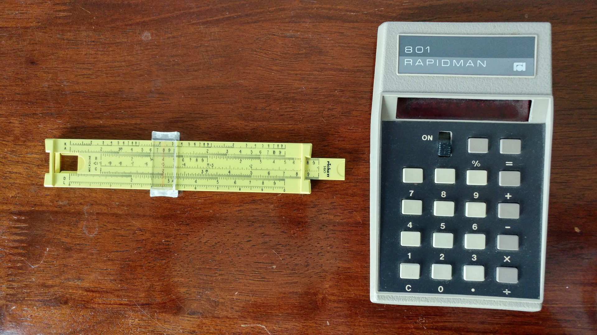
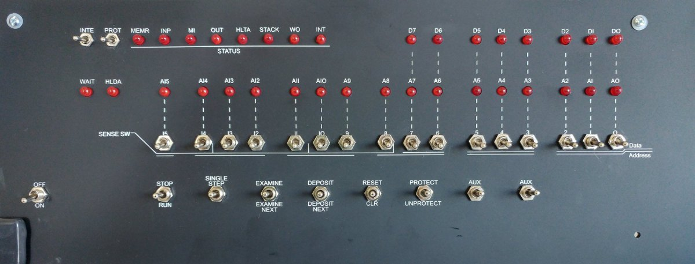

--------------------------------------------------------------------------------
# Coming out of the Computer Dark Ages

A long time ago in a high school far, far away, a teenager read the front cover of a magazine, "World's First Minicomputer...Altair 8800."
I read that Popular Electronics article over and over.
````
It was a period of technology darkness.
Students were taught slide rulers in
math. There were early victories,
rebels against the evil technophobes
had bought their own calculators,
the lightsabers of the age.
````
The Altair 8800 was the first home computer that a regular person like me, could buy.
I lived in the country side.
Yeah, it was rural, a village of 500 people. When I finally left, there was a guy out changing the sign to 499.
I had only seen a computer once before on a school trip.
It was a mechanical monster filling a small room. In science fiction terms, it was a steampunk computer.
The Altair 8800 was a modern electronic wonder.

I could buy one for $600, which is $3,000 adjusted to 2019 dollars.
The Altair 8800 was the first home computer, the Model-T of computers.
Or, as I prefer to call it, the Chevy Corvette of home computers, the first American affordable, popular, sports car, computer.
Because I had worked all summer on a golf course making over $1/hour, I could afford the basic computer.
Yeah, I was working full time. And yeah, I was under 16 years old.
But we didn't call it child slave labor, our parents called it, "Get your lazy ass up and do something" work.

Alas, I was short on funds to buy a component to save and load programs.
The basic computer was a CPU with 256 bytes of memory with a simple data entry system and an LED light display.
Functional, however, no permanent storage. Which meant, your entered program work was lost when it was powered down.
And I couldn't afford the $10,000 (2019 dollars) for a floppy drive. So no computer for me while I was in high school.

--------------------------------------------------------------------------------
[Link](https://www.in2013dollars.com/us/inflation/1975?amount=621) to the inflation calculator used in this article.
For example, my calculator cost me $30 in 1975, which is $140 in 2019 dollars.
Besides the basic four functions, it also calculated percentages.



In the above photo, the slide ruler is set to calculated answer of, 2 x 4.

--------------------------------------------------------------------------------
## My 2019 Altair 8800 Emulator

I'm in the final stage of designing and building my basic Altair 8800 emulator.

Instead of a smartphone's touch screen display, the Altair 8800 had toggles and LED lights.
The following photo is my Altair 8800 replica front panel. Retro, very retro.



Mine will replicate the 8800's user experience.
I can enter programs by flipping toggles, and then have the enjoyment of watching flashing LED lights as the program runs.
As an upgrade from the basic 8800, my Altair, which I'm calling the Altair 101, will also have the ability to save and load programs.

--------------------------------------------------------------------------------
The project started late October, 2019.
I began with a study of the Altair clone videos
The [first video](https://www.youtube.com/watch?v=suyiMfzmZKs) was a great intro.
From the [second video](https://www.youtube.com/watch?v=EV1ki6LiEmg), I learned how to write an Altair 8800 program.
They clearly showed how to use the toggles to entry and control programs.
For a learning experience, I wrote out the steps the presenter went through to enter and run a program.

I wanted to try it on a real Altair computer. I seen one on eBay for $5,000.
Too much for me. Also, I didn't want to get into maintaining an old machine.
My first computer was a 1983 machine based on the 8086 processor. Cost over $8,000 (adjusted to 2019 dollar value).
It had 384K of memory. I didn't want that again. I only wanted the fun side of running retro.

The 8080 was an 8 bit microprocessor produced by Intel, released in 1974.
The 8085 was an 8 bit microprocessor produced by Intel, released in 1976.
They have the same opcodes. The 8085 has few enhancements that made it easier to work with.
The 8086 was a 16 bit microprocessor produced by Intel, released in 1978.
The Intel 8088, released July 1, 1979. It was in the IBM PC, the first computer I had a job working on.
The 8088 was an 8 bit microprocessor produced by Intel. It's allowed the building of cheaper computer.

8085 Java assembler
https://sourceforge.net/projects/j8085sim/

--------------------------------------------------------------------------------
### Next Development Steps

Note, the computer has the basic Altair 8800 functionality.
+ It runs Kill the Bit, which is the standard de facto demonstration program.
+ The Altair 101 only has only 256 bytes of memory which is the same as the original basic Altair 8800.
+ Modern clones and replicas have 64K of memory.
+ Another difference, is that I don't have all the 8080 opcodes implemented.
+ Later, I can add external memory and more implement more opcodes.

##### Complete the Dev Machine

After fixing and completing, the toggle console, the components on a $4 clipboard.
This will allow me to use it like an Android tablet.
````
+ Mount the breadboards onto the clipboard.
+ Use a cable to plug into a USB power supply that is plugged in a wall socket.
+ Control the power with an on/off toggle, or use a USB hub with on/off switches.
+ For portability, I should test using a 9V power supply.

Re-wire the breadboards:
  + 1 breadboard for shift registers.
  + 1 for LED lights: status, address, and data.
  + 1 for the Nano and other components.

---------------------------------------------
Add I/O components and controls.

  Integration testing:
  + Add an SD card reader or clock module onto the Nano.
  ++ Clock module also has 4K bytes of EEPROM that can be used for saving/loading programs.
  ++ Use an on/off/on toggle: up to save (upload), down to load (download).
  + Maybe use Nano to Nano communications to add another Nano to manage the SD card reader and LCD.

  Add DS3231 clock.
  + Add HLDA status light to signal when running in clock mode.
  + Use an on/off/on toggle to display the time on the LCD.
  + Time is shown on the LCD, when the LCD isn't used by a running program.
  + Program option to take over the LEDs to display the time.

  Add a 1602 LCD,
  ++ Confirm messages on the LCD: "Confirm, save to file x." Or, "Confirm, load file x."
  +++ The file number, is the toggle value. For example, 003.MEM, is A8 and A9 toggles up.
  ++ View the result: "Saved.", "Loaded.", or "Error."

  Add MP3 player (DFPlayer) and amp.
  ++ Controled using an infrared controller. At first, independent from programs running.

  ---------------------------------------------
  Build my first Altair 101 machine,

  + Complete the final design that will use an Arduino Mega for straight forward expansion.
  + Order parts to build the machine.
  + Make enhancements to the case so that it's ready for the electronic parts.
  + Wire new breadboards to fit into the case.
  + Put it all together.
````

--------------------------------------------------------------------------------
### Down the Retro Path

A quick search showed that their are modern clones, simulators, and emulators available.

I decided to use my favorite microcontroller, Arduino Nano, to start developing.
I wrote a processor program with a few working operational machine codes that I seen run on the Altair 8800 clone videos.

My hardware goal was to,
+ Build a computer that has an [Altair 8800 clone front panel](https://www.adwaterandstir.com/product/front-panel/),
similar LEDs and toggles to an [original Altair 8800](https://en.wikipedia.org/wiki/Altair_8800).
+ Use a minimum amount of soldering as I such at soldering.
+ Use module boards, modern chips, and other electronic components.
+ I'll build on breadboards.

My software goal was to,
+ Run original machine code which gives it the basic Altair 8800 functionality.
+ I would simulate the Intel 8080 operational machine codes, opcodes as they're called.
+ My processor program would use simple coding methods and only be a single file program.
    This makes easy, a single file, [Processor.ino](Processor/Processor.ino).
+ Other developer's programs were too complex for me. I wanted code that was easy to modify and extend.

The first phase is to write the processor software.
In parallel, start designing and building a development machine.
The longer term goal was to have the Altair 101 run the classic Altair 8800 programs Kill the Bit, and Pong.
And, to be able to save and load programs using an SD card module.

To the base machine, I planned to add modern components and functionality:
+ Infrared receiver to receive commands and data from a remote control, such as a TV remote.
+ A real time clock that can display the time on the front panel,
+ A digital display,
+ MP3 player for playing sounds and music,
+ and yes, connect it to the internet.

#### Getting Started with an Altair 8800 Clone Front Panel

A major milestone will be when I have enough opcodes, operational instructions, to run the classic program, 
[Kill the Bit](https://youtu.be/ZKeiQ8e18QY).
I will use an Arduino Nano microprocessor sketch program to interpret and process each operational instruction.

I don't intend to implement full Altair 8800 operational instructions.
For example, my machine will not run Basic, nor will it run CPM. Anyway, you can run those on a laptop computer using an emulator.
I just want a computer that looks and feels like the limited edition that was available in 1975.
That version did not have any interfaces. It cost $621 with extremely limited utility.

If I had worked during one high school summer, I could have bought one and had a few bucks to spare.
I didn't buy one because without other parts, there was little it could do.
After entering a program, it couldn't even save the program. I would need to re-enter the program every time it was turn off and back on.
A usable disk drive cost 3 times as much as the computer.
Too much a poor high school student doing golf course maintenance work for under $2/hour.

--------------------------------------------------------------------------------
### Development Steps

Mid October

Seen an Altair 8800 on the British show, [The IT Crowd](https://theitcrowd.fandom.com/wiki/The_IT_Crowd).
The Centre for Computing History had loaned the show an Altair 8800.
This got me to thinking, and remembering, how I wanted one when they came out in 1975.
At the time, I could afford the base machine, but, it had no save and load method.
So, once I entered a program, it would be lost when powered down.
Save and load hardware cost even more than the machine, which I couldn't afford.

I began watching Altair 8800 videos.
I read Altair clone websites.
[Altair 8800 clone](https://altairclone.com/) for $600, replicas for 
[Altair-Duino replica](https://www.adwaterandstir.com/2017/08/14/but-what-could-you-actually-do-with-an-altair-8800/)
kits for $180 or $250. But my soldering skills suck, I wasn't about to attempt a PCB kit.

I took note of their design features:
+ A case, plastic or metal
+ An [Arduino](https://www.arduino.cc/en/main/products) Duino or Mega
+ Free [open-source software simulator](https://www.hackster.io/david-hansel/arduino-altair-8800-simulator-3594a6),
    by David Hansel. Or write your own.

All I needed was case, an Arduino microcontroller, and simulation software to emulate an Altair 8800.
It took a while to figure out what constituted a simulator,
+ The ability to run Intel 8080 machine code.
+ Interact with the front panel toggles and LED lights.
+ Make use of external I/O devices such as serial communications to a terminal or device reader such as an SD card module.

After I had mostly designed my machine and had half of it working, I found two others that used a Nano.
They also had written their own emulator program.
Viewing their code, websites, and videos, I noted that I was on track, that my design and program would work.

The simulator emulator clone replicas, used SD card for reading programs.
An SD card module was under $2. I could build a replica with an SD card module.

Next, came the research and design stage.

To get started, I put together components on a breadboard,
+ Nano, SD card read/write module.

Nice history video.
https://www.youtube.com/watch?v=X5lpOskKF9I

````
  ---------------------------------------------
  Hardware and software updates to complete the core system:

  Completed: Add 8 toggles and a total of 3 x 595 chips, to the dev machine.
  + Solder and add 8 toggles (on/off) to the dev machine.
  ++ Add toggle software controls from the shiftRegisterInputToggle program.
  Emulator Program Logic,
  + Add Reset, which resets the program counter 0, to start a program over.
  + When a program is running,
  ++ Only monitor and execute options: STOP and RESET.
  + When a program is not running,
  ++ Monitor and execute options: RUN, SINGLE STEP, EXAMINE, EXAMINE NEXT, Examine previous, and RESET.
  ++ Use the toggle address to Examine data in program memory.
  ++ Use the toggle binary value to Deposit data into program memory.
````

Now, I can do, what is done, in the [Altair programming video](https://www.youtube.com/watch?v=EV1ki6LiEmg):
Altair 8800 - Video #2 - Front Panel Programming.

````
  Emulator Program Logic,
  + When a program is running,
  ++ Use the toggles as sense switches (input) via the IN opcode.
  ++ Load and play, Kill the Bit.
  ++ Pause and change the bit move speed. Then start it up again using RUN or RESET.
````

The Altair 101 is basically, functionally, complete!

My computer finally has the basic functionality of an Altair 8800.
It can run the [Kill the Bit program](https://www.youtube.com/watch?v=ZKeiQ8e18QY),
which is the standard defacto basic demonstration program of an Altair 8800 and its clones, and replicas.

The major difference with other clones and replicas,
is that I haven't implemented all the 8080 opcodes implemented.

  Test it out...

````
  ---------------------------------------------
  Add modern I/O components,

  Add SD card,
  + Save program memory to card, load program memory from card.
  ++ Use an on/off/on toggle: up to save (upload), down to load (download).

  Add a 1602 LCD,
  ++ Confirm messages on the LCD: "Confirm, save to file x." Or, "Confirm, load file x."
  +++ The file number, is the toggle value. For example, 003.MEM, is A8 and A9 toggles up.
  ++ View the result: "Saved.", "Loaded.", or "Error."

  Add DS3231 clock.
  + Use an on/off/on toggle to display the time on the LCD.
  + Time is shown on the LCD, when the LCD isn't used by a running program.
  + Program option to take over the LEDs to display the time.

  Add MP3 player (DFPlayer) and amp.
  ++ Controled using an infrared controller. At first, independent from programs running.

  ---------------------------------------------
  Build my first Altair 101 machine,

  + Complete the final design.
  + Order parts to build the machine.
  + Make enhancements to the case so that it's ready for the electronic parts.
  + Build a new breadboard computer to fit into the case.
  ++ Use an Audruino UNO.
  + Put it all together.

  ---------------------------------------------
  Program Development Phase

  + A basic assembler to convert assembly programs into machine code.
  + Implement the next major Altair 8800 sample program, Pong.
  + Update and enhance my set of test and development programs.
  ++ Samples: looping, branching, calling subroutines.
  ++ Continue adding opcodes with sample programs to confirm that the opcodes are working correctly.

````

--------------------------------------------------------------------------------
#### Reference links

[Front panel programs](https://altairclone.com/downloads/front_panel/) such as Pong and Kill the Bit.

David Hansel wrote an [Altair 8800 simulator](https://www.hackster.io/david-hansel/arduino-altair-8800-simulator-3594a6).
It is the code people use when using an Arduino Due to build an Altair 8800 clone/simulator computer.

[Altair 8800 Emulator Kit](https://www.adwaterandstir.com/product/altair-8800-emulator-kit/), $179.95 – $249.95
+ Home page
https://www.adwaterandstir.com/altair/

Very nice [Altair 8800 Clone](https://altairclone.com/).
+ It has an amazing case that was designed based on the original.
+ Click [here](https://altairclone.com/downloads/interview.mp3)
    to hear an interview with the Altair 8800 clone creator, Mike Douglas.
+ I am following his [Altair 8800 instructional videos](https://www.youtube.com/playlist?list=PLB3mwSROoJ4KLWM8KwK0cD1dhX35wILBj)
    to build my processor emulation software and hardware. I want my machine to do the basics of what his machine can do.
+ Altair 8800 Clone [order information](https://altairclone.com/ordering.htm), (assembled) $621.

Another Altair Clone: [GitHub](https://github.com/companje/Altair8800), [website](http://www.companje.nl/altair.html).
This one has similarities to my machine: runs on an Arduino UNO(Nano), and simple code base.
It uses 74HC595 for LED outputs, and 74HC166 for inputs, and a 23LC1024 for 128KB RAM.

[Zork online](https://classicreload.com/zork-i.html) or [Another Zork[(https://archive.org/details/msdos_Zork_I_-_The_Great_Underground_Empire_1980)

+ [Directory](https://altairclone.com/downloads/cpu_tests/) of nice sample assembler programs
such as this [8080 opcode test program](https://altairclone.com/downloads/cpu_tests/TST8080.PRN).
+ [Extract highByte()](https://www.arduino.cc/reference/en/language/functions/bits-and-bytes/highbyte/)
+ [Extract lowByte()](https://www.arduino.cc/reference/en/language/functions/bits-and-bytes/lowbyte/)
+ Reference document, [Intel 8080 Assembly Language Programming Manual](https://altairclone.com/downloads/manuals/8080%20Programmers%20Manual.pdf).
  This section is base on section 26: [8080 Instruction Set](https://www.altairduino.com/wp-content/uploads/2017/10/Documentation.pdf).
+ Text listing of [8080 opcodes](https://github.com/tigerfarm/arduino/blob/master/Altair101/documents/ProcessorOpcodes.txt).
  [Binary listing](https://github.com/tigerfarm/arduino/blob/master/Altair101/documents/8080opcodesBinaryList.txt).

  In computing, an emulator([Wikipedia](https://en.wikipedia.org/wiki/Emulator))
is hardware or software that enables one computer system (called the host) to behave like another computer system (called the guest).
  An emulator typically enables the host system to run software or use peripheral devices designed for the guest system.
    
  Logic simulation is the use of a computer program to simulate the operation of a digital circuit such as a processor. This is done after a digital circuit has been designed in logic equations,
  but before the circuit is fabricated in hardware.
  For example, a computer specially built for running programs designed for another architecture is an emulator.
  In contrast, a simulator could be a program which runs on a PC, so that old Atari games can be simulated on it.  
  The term "emulation" often means the complete imitation of a machine executing binary code.
  The term "simulation" often refers to computer simulation,
  where a computer program is used to simulate an abstract model.
  
--------------------------------------------------------------------------------
Cheers