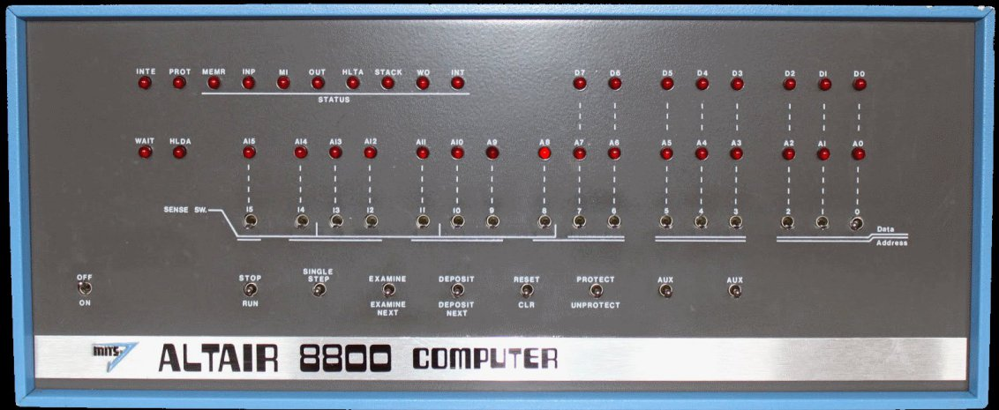

--------------------------------------------------------------------------------
# Altair 101 Project Notes

This computer, which I call the Altair 101, is designed and will be built for a user experience.
It is meant to replicate the user experience of flipping toggles for data entry and watching lights flash to see the results.

My goal to build a computer that has an [Altair 8800 clone front panel](https://www.adwaterandstir.com/product/front-panel/),
similar LEDs and toggles to an Altair 8800, and have the base Altair 8800 functionality.
This will give the computer an Altair 8800 look and feel from the user's point of view.

A major milestone will be when I can enter and run the classic, Kill the Bit program, on my Altair 101.
I will use an Arduino Nano microprocessor and supporting chips to control the I/O and run the computer's processes.
I will use the [Altair 8800 online simulator](https://s2js.com/altair/sim.html) ([homepage](https://s2js.com/altair/))
to compare the original functionality with my Altair 101.

#### Altair 8800 Front Panel

[](https://s2js.com/altair/sim.html)

+ Click [here](https://altairclone.com/downloads/)
    for high end Altair 8800 clone.
+ Click [here](https://altairclone.com/downloads/)
    for Altair 8800 original and clone documents.
+ Click [here](https://altairclone.com/downloads/interview.mp3)
    to hear an interview with the Altair 8800 clone creator, Mike Douglas.

Note, I don't intend to implement full Altair 8800 functionality.
For example, my machine will not run Basic, nor will it run CPM.
I just want a computer that looks and feels like the limited edition that was available in 1975.
That version did not have any interfaces. It cost $621 with extremely limited utility.
If I had work all summer during my high school years, I could have bought one and few bucks to spare.
However, I didn't buy one because without the other parts, there was little it could do.
It couldn't even store programs that were entered. 
It cost $1,980, 3 times the price of the computer, to have a usable disk drive.

See the original [price list](https://altairclone.com/ordering.htm) to see parts that were available and their costs.

--------------------------------------------------------------------------------
### Phase 1, Front panel I/O for Memory management

The first phase starts with a basic memory model and management.

The memory model,
+ Memory will be an array structure in a Nano runtime sketch.
+ Each array index in a memory address.
+ Each array is an 8 bit data value.
+ Example: altairMem[2] is memory address 2.
+ Address 2 is represented in LEDs as, high byte: 0 000 000 0 (octal: 000), and low byte: 00 000 010 (octal: 002).
+ If the value of altairMem[2] is three, then the data value is: 00 000 011 (octal: 003).

The memory management from the Altair 101 front panel,
+ There will be 8 LEDs to display one 8-bit memory data value.
+ There will be 16 LEDs to display one 16-bit memory address.
+ The 8 lower byte address toggles will be used for memory data input.
+ The 16 upper and lower byte address toggles will be used for memory address input.
+ One on/off/on momentary toggle to Examine and Examine next address data values.
+ One on/off/on momentary toggle to Deposit and Deposit next address data values.
+ One on/off/on momentary toggle to Reset or CLR (clear): sets data and address LEDs on, then data and address LEDs go off.

+ One on/off toggle to turn the computer's power on and off.

--------------------------------------------------------------------------------
### Phase 2, Enter and Run Altair 8800 programs

After memory management works, the next phase is to develop an emulator to run Altair 8800 machine code.

I will use the Altair 8800 online simulator to enter and run sample programs.
+ https://s2js.com/altair/sim.html
+ Then, I will do the same steps on my Altair 101. The result needs to be the same.
+ I entered and ran the jump loop program into the simulator. Now I need to implement the same in my Altair 101.

Front panel components to implement,
+ One on/off/on momentary toggle to STOP and RUN programs.
+ One on/off/on momentary toggle to STEP through a program, one program instruction at a time.
+ Add a WAIT LED.
+ The WAIT LED is on when a program is not running.
+ The WAIT LED is off when a program is running.
+ The WAIT LED remains on when stepping through a program.
+ Add the first operational instruction, the JMP instruction.

Test by entering a program called: jump loop.
+ Note, values not digital, are octal.
+ The first program will an infinite loop. The first instruction is at address location 0.
+ Example: 8 is binary: 1000 or represented in address LEDs as 00 001 000 which is octal 010.
+ Address 0 has the instruction to jump to address 6.
+ Address 0(000) - data: 303. A jump instruction value.
+ Address 1(001) - data: 006. Lower byte of the address to jump to.
+ Address 2(002) - data: 000. Upper byte of the address to jump to.
+ Address 6(006) - data: 303. A jump instruction value.
+ Address 7(007) - data: 000. Lower byte of the address to jump to.
+ Address 8(010) - data: 000. Upper byte of the address to jump to.
+ Since the program doesn't use any other memory, the above is the complete program.
+ The instruction in address 6. The program will jump to address 0.

Run the program one step at a time,
+ Set address toggles to 0.
+ Flip the Examine toggle.
+ Data LEDs show the jump instruction: 11 000 011(303).
+ Address LEDs show 0: 00 000 000(000).
+ Flip the STEP toggle.
+ Data LEDs show the jump instruction: 11 000 011(303).
+ Address LEDs show 6: 00 000 110(006). The computer has jumped to address 6.
+ Flip the STEP toggle.
+ Data LEDs show the jump instruction: 11 000 011(303).
+ Address LEDs show 0: 00 000 000(000).
+ Each time the STEP toggle is flipped, the address LEDs change between 0 and 6..
+ You entered and run your first program one step at a time.

Run the program,
+ Set address toggles to 0.
+ Examine address 0. The wait LED is on.
+ Flip the RUN toggle. The wait LED goes off. The program starts running.
+ Data LEDs show the jump instruction: 11 000 011(303).
+ Address LEDs show 6: 00 000 110(006).
+ Flip the STOP toggle to stop the program. The wait LED goes off.
+ Data LEDs show the jump instruction: 11 000 011(303).
+ Address LEDs show 6: 00 000 110(006).
+ You entered and run your first program.

Next, implement the following,
+ Save programs from memory onto an SD card.
+ Load programs from an SD card into memory.
+ Add more operational instructions to run Kill the Bit, and Pong.

#### For Reference

Altair 8800b Instruction set.
http://brooknet.no-ip.org/~lex/altair/_altair88b/manual/instructMain.html
+ Example: JMP (jump) is octal 303 (11 000 011)
+ The jump instruction is followed by 2 bytes of data in the next two memory addresses.
+ The program will jump to that 16 bit address and continue processing.

Binary Calculator
https://www.calculator.net/binary-calculator.html

--------------------------------------------------------------------------------
### Phase 3, Enhance with Modern Components and Functionality

Add modern components:
+ Real time clock using a DS3231 board.
+ A DFPlayer, amp, and speaker for sound.
+ NodeMCU for internet access.

Add new operational instructions for the modern components:
+ Select to use computer clock speeds of one second, one minute.
For example, create a clock where the hours and minutes are display as binary values on the front panel.
+ Control the playing of MP3 files.
+ Interface to receive commands from the internet and return a response.

Maybe add the following:
+ Small LCD screen such as an 1602 LCD.
+ 7-segment LEDs. For example, to display data and memory digitally for the clock display.
+ Keypad or keyboard input
+ Serial terminal interface to send commands and receive results
+ Infrared receiver input to computer instructions.

--------------------------------------------------------------------------------
## Altair 8800, the Original and Clones

The following is the base look and functionalit I intend for my computer.

+ Nice programming sample. The creator of the video has an actual Altair 8800.
https://www.youtube.com/watch?v=oZ1xHyuf0Bs
+ First, shows the Altair-Duino
+ Describes the functionality of the front panel.
For example, the lower LEDs is the address, upper LEDs is the data value.
+ Load a program.
+ Run the program.

The following is how to get started, from the following link.
https://www.ztop.com.br/gadget-do-dia-altair-8800-clone-computer/

-----------------------------
### The front panel.

Excellent front panel video:
https://youtu.be/suyiMfzmZKs

+ I bought the front panel, $18.00, Laser-cut and screen printed 15″ x 6″ front panel for the Altair-duino kit
https://www.adwaterandstir.com/product/front-panel/

Front panel lower toggle buttons:
+ Far left, toggle switch: OFF/ON.
+ The other buttons flip up and flip down, always returning to the center.
+ STOP and RUN: stop a running program, and initiate a program.
+ Flip up for STOP. Flip down for RUN.
+ Flip up for SINGLE STEP, to step through memory: shows the address and data for each memory byte.
+ EXAMINE and EXAMINE Next.
+ DEPOSIT and DEPOSIT Next.
+ RESET and CLR (clear)
+ PROTECT and UNPROTECT - rare, if ever used
+ AUX - never really used
+ AUX - never really used

Front panel upper toggle buttons,
+ Labeled: SENSE SW (sense switches).
+ For setting and entering addresses and data.
+ Toggle up (on) or down (off) position.
+ When the program was running, the left 8 toggles could be used as input to the program.

Front panel LEDs:
+ Right top 8 LEDs are for 8 bit data display: D7 ... D0. Data range: 0-255.
    When running, doesn't necessarily show what is on the bus; sometimes yes, other times, no.
+ Lower 16 (8 + 8) are for 16 bit memory address display: A15 ... A0 
    Set on/off when selecting an address, or flashing when a program is running.
+ Note, octal organized: 3 bits each octal.
+ Top left 10 LEDs are status lights: memory cycles, state:
+ INTE PROT MEMR INP MI(memory read) OUT HLTA STACK WO INT
+ 2 LEDs below, are: WAIT and HLDA

+ Total LEDs = 10 + 8 + 2 + 16 = 36 LEDs
+ Total toggles = 17 = 16 (for address entry) + 1 (on/off)
+ Total center return toggles = 8 : flip up or flip down. When not flipped, returns to center.

--------------------------------------------------------------------------------
## Operations, How to Turn an Altair 8800 on

+ To turn it on, flip the On/Off toggle down. It turns on in a stopped state.
+ Lights on: MEMR, MI, WO.
+ Lights on: WAIT.
When first turning on, reset and clear it to get started,
+ On another video, the person flipped Stop, and Reset.
+ Or, in the video I'm following,
    Raise and hold STOP, and press RESET (up): All address and data bit LEDs go on. Other LEDs are off.
+ When released, address LEDs go off, program counter is all zeros.
    Data LEDs is the random data value in zero memory location.
+ Lights on: MEMR, MI, WO.
+ Lights on: WAIT.

To see what is in memory location 2,
+ Set the sense switches (toggles) to address 2 (00 000 010) and flip up EXAMINE (switch returns to center).
+ EXAMINE Next will increase the memory location LEDs and display the memory value with the data LEDs.

-----------------------------
## Operations, Viewing and Entering data values

#### Set values into addresses.

To set a data value at memory address 0,
+ Set the address toggles to the value of the memory location to be set, example 0 (00 000 000).
+ Flip EXAMINE.
+ Address LEDs show the value 0 (00 000 000), and the current random value in the data LEDs.
+ Set the sense switch toggles to the value that is to be stored, example 7 (00 000 111).
+ Flip DEPOSIT.
+ Data LEDs show the value 7 (00 000 111).

Set a data value in the next address (1),
+ Flip NEXT.
+ Address LEDs show the value 1 (00 000 001), and the current random value in the data LEDs.
+ Set the sense switches to the value that is to be stored, example 6 (00 000 110).
+ Flip DEPOSIT.
+ Data LEDs show the value 6 (00 000 110).

Set a value in the next address (2),
+ Flip NEXT.
+ Address LEDs show the value 2 (00 000 010), and the current random value in the data LEDs.
+ Set the sense switches to the value that is to be stored, example 5 (00 000 101).
+ Flip DEPOSIT.
+ Data LEDs show the value 5 (00 000 101).

Shorter method to set a value in the next location (3),
+ Set the sense switches to the value that is to be stored, example 4 (00 000 100).
+ Flip DEPOSIT NEXT.
+ Address LEDs are incremented to address 3: 00 000 011.
+ Data LEDs show the value 4 (00 000 100).

Set a value in the next address (4),
+ Set the sense switches to the value that is to be stored, example 3 (00 000 011).
+ Flip DEPOSIT NEXT.
+ Address LEDs are incremented to address 4: 00 000 100.
+ Data LEDs show the value 3 (00 000 011).

Set a value in the next address (5),
+ Set the sense switches to the value that is to be stored, example 2 (00 000 010).
+ Flip DEPOSIT NEXT.
+ Address LEDs are incremented to address 5: 00 000 101.
+ Data LEDs show the value 2 (00 000 010).

Set a value in the next address (6),
+ Set the sense switches to the value that is to be stored, example 1 (00 000 001).
+ Flip DEPOSIT NEXT.
+ Address LEDs are incremented to address 6: 00 000 110.
+ Data LEDs show the value 1 (00 000 001).

Set a value in the next address (7),
+ Set the sense switches to the value that is to be stored, example 0 (00 000 000).
+ Flip DEPOSIT NEXT.
+ Address LEDs are incremented to address 6: 00 000 111.
+ Data LEDs show the value 1 (00 000 000).

To view the data value entries,
+ Set the sense switches to address: 0 (00 000 000).
+ Flip EXAMINE.
+ Flip EXAMINE NEXT, 6 more times to the above entries.

--------------------------------------------------------------------------------
### How to Enter and Run a program

Video on entering and running the program, Kill the Bit.
https://youtu.be/ZKeiQ8e18QY

I need find the view with the steps to enter a simple jump around program.

---------
Kill the Bit game by Dean McDaniel, May 15, 1975.
+ Object: Kill the rotating bit. If you miss the lit bit, another bit turns on leaving two bits to destroy.
+ Quickly toggle the switch, don't leave the switch in the up position.
+ Before starting, make sure all the switches are in the down position.  

https://altairclone.com/downloads/killbits.pdf

Enter the following, starting at location 0.
Data Values:
````
041 000 000 026 200 001 016 000 032 032 032 032
011 322 010 000 333 377 252 017 127 303 010 000
````
Following is how to enter the above program.
+ Set all the address toggles to 0.
+ Flip EXAMINE, to view memory data from memory address location 0.
+ Enter the first octal value from the above program listing, 041.
+ 041 is 0(00) 4(100) 1(001) >> 00 100 001
+ Flip DEPOSIT NEXT.
+ Enter each of the values, flipping DEPOSIT NEXT each time.
````
Address LEDs    Value from above:

00 100 001     041
00 000 000     000
00 000 000     000
00 010 110     026
10 000 000     200
00 000 001     001
00 001 110     016
00 000 000     000
00 011 010 beg:032
00 011 010     032
00 011 010     032
00 011 010     032
00 001 001     011
11 010 010     322
00 001 000     010
00 000 000     000
11 011 011     333
11 111 111     377
10 101 010     252
00 001 111     017
01 010 111     127
11 000 011     303 jmp: Jump instruction: jmp beg
00 001 000     010      To address 8. 00 001 000 = 8. Low order address bits.
00 000 000     000 end: High order address bits, to get a 16 bit address: 00 000 000 00 001 000 = 8.
````
Once enter, review, to confirm correct entry.
+ Set the address toggles to 0.
+ Flip EXAMINE, to view memory data from memory address location 0.
+ Flip EXAMINE NEXT.

The Program in assembler code:
````
0000           org     0
0000 210000    lxi     h,0     ;initialize counter 
0003 1680      mvi     d,080h  ;set up initial display bit 
0005 010E00    lxi     b,0eh   ;higher value = faster 
0008 1A   beg: ldax    d       ;display bit pattern on 
0009 1A        ldax    d       ;...upper 8 address lights 
000A 1A        ldax    d 
000B 1A        ldax    d 
000C 09        dad     b       ;increment display counter 
000D D20800    jnc     beg 
0010 DBFF      in      0ffh    ;input data from sense switches 
0012 AA        xra     d       ;exclusive or with A 
0013 0F        rrc             ;rotate display right one bit 
0014 57        mov     d,a     ;move data to display reg 
0015 C30800    jmp     beg     ;repeat sequence 
0018           end
````
To run the program,
+ Set all sense switches to 0.
+ Flip EXAMINE.
+ Flip RUN.
+ The WAIT LED goes off.
+ Data LEDs show the data values flashing.
+ Left 8 address LEDs (A15...A8) show an incremental light on/off, around and around, from A15 to A8.
+ Left 8 sense switches are for input.
+ Flip a sense switch up when the the LED above the switch is on.
+ If you do, the bit is killed. If not, another bit (LED) begins to flash.

Flip RESET will restart the program while it's running.

To stop the program, hit STOP. The WAIT LED goes on.
+ Flip RESET.
+ Flip RUN to restart the program.

-----------------------------
+ Instruction set.
http://brooknet.no-ip.org/~lex/altair/_altair88b/manual/instructMain.html
+ Example: jump (jmp) 11 000 011 

+ How to load software onto the Arduino Due.
https://www.adwaterandstir.com/install/
+ Code repository
https://github.com/dhansel/Altair8800

+ How to build one.
https://www.hackster.io/david-hansel/arduino-altair-8800-simulator-3594a6
+ Build your own.
https://spectrum.ieee.org/geek-life/hands-on/build-your-own-altair-8800-personal-computer
+ About, with parts list
https://www.hackster.io/david-hansel/arduino-altair-8800-simulator-3594a6
+ Getting started with the Arduino Due
https://www.arduino.cc/en/Guide/ArduinoDue
+ The Arduino Due is a microcontroller board based on the Atmel SAM3X8E ARM Cortex-M3 CPU.
It is the first Arduino board based on a 32-bit ARM core microcontroller.
+ The microcontroller mounted on the Arduino Due runs at 3.3V
+ 54 digital input/output pins, 12 analog inputs
+ Uses CH340G drivers
+ DUE R3 Board SAM3X8E 32-bit ARM Cortex-M3 Control Board Module For Arduino, US $14.64
https://www.ebay.com/itm/DUE-R3-Board-SAM3X8E-32-bit-ARM-Cortex-M3-Control-Board-Module-For-Arduino/141976885203

+ Assembled & Tested, $279.95 – $349.95
https://www.adwaterandstir.com/product/altair-assembled/

+ Uses the Arduino Due which is an Arduino for more powerful larger scale projects.
https://store.arduino.cc/usa/due
++ The Arduino Due is the first Arduino board based on a 32-bit ARM core microcontroller.
++ 54 digital input/output pins, 12 analog inputs, a 84 MHz clock

+ Intro to the Arduino Due
https://www.theengineeringprojects.com/2018/09/introduction-to-arduino-due.html

+ Altair 8800 Instructional Videos
https://www.youtube.com/playlist?list=PLB3mwSROoJ4KLWM8KwK0cD1dhX35wILBj

Google forums:
https://groups.google.com/forum/#!forum/altair-duino

+ Manual
https://grantmestrength.github.io/RetroComputerInstructionManual/
https://github.com/GrantMeStrength/RetroComputerInstructionManual

+ original Altair manual
http://www.classiccmp.org/dunfield/altair/d/88opman.pdf

+ Altair 8800 Clone, Ordering Information, (assembled) $621
https://altairclone.com/ordering.htm

+ MITS Altair Simulator, written entirely in Javascript.
+ and with thanks to Martin Maly and Chris Double for their 8080.js Intel 8080 emulator. 
https://s2js.com/altair/
https://s2js.com/altair/sim.html
https://github.com/maly/8080js

--------------------------------------------------------------------------------
### Parts to order to build my Altair 101

Parts list from a clone:
https://www.hackster.io/david-hansel/arduino-altair-8800-simulator-3594a6

+ Front panel, sticker, case, and shipping = $74
+ Nano + on/off/on momentary toggles + on/off toggles + red LEDs
+ 20pcs 74HC595 + pin expander module PCF8574 + cables
+ Total = $95 = $74 + $3 + $7 + $2 + $2 + $3 + $4

+ Ordered Altair 8800 Front panel with sticker, standard case, and shipping: $74
https://www.adwaterandstir.com/product/front-panel/
````
Order number: 11282
Date: October 22, 2019
Altair 8800 Front panel: $18.00	
Altair 8800 Front Panel Sticker: $5.00
Shipping: $13.00
````
+ After paying for the order, I communicated with the manufacturer and ordered the regular case: $38 = $35 + $3.10 shipping.
+ Total: $74

+ Nano
https://www.ebay.com/itm/MINI-USB-Nano-V3-0-ATmega328P-CH340G-5V-16M-Micro-controller-board-for-Arduino/383093281539

+ SPDT On/Off/On 3 Position Momentary toggles, Diameter: 6mm (0.2inch), Micro mini, 10pcs for $6.79
https://www.ebay.com/itm/10pcs-Red-3-Pin-3-Position-ON-OFF-ON-SPDT-Micro-Mini-Momentary-Toggle-Switch/223490809691

+ SPDT On/On 2 Position Mini Toggle Switch, 10Pcs for $2.68
https://www.ebay.com/itm/10Pcs-AC-250V-1-5A-125V-3A-SPDT-3-Pin-On-On-2-Position-Mini-Toggle-Switch-Blue/272882765795

+ Red LED 5mm, 100pcs for $1.50
https://www.ebay.com/itm/100Pcs-LED-Lights-Emitting-Diodes-Lamp-Parts-3mm-5mm-for-Electronics-Arduino-DIY/202692215007?var=502802895935

+ 220Ω, 470Ω, 560Ω, 1k, or 3k resistors?
+ Need to test to get the right ohms for brightness and wattage for physical size.
+ Use A09 Network Resistor 9-pin module?

+ Shift Register SN74HC595N, 20pcs for $2
https://www.ebay.com/itm/5-10-20pcs-Chip-Stable-2-0-6-0-V-74HC595-8-Bit-IC-Shift-Register-SN74HC595N/173212029799?var=471929852731

+ Cables
https://www.ebay.com/itm/140Pcs-Solderless-Breadboard-Jumper-Cable-Wire-Kit-Box-For-Arduino-Shield-DIY/123825122614

+ 10uf capacitor across positive and ground when using chips: SN74HC595N.

----------------
#### Parts to test

+ GPIO Port Extenders chip: PCF8574 should work for toggles.

+ An option to consider, is addressable LEDs that come on strips.
+ Arduino – Controlling a WS2812 LED strand with NeoPixel or FastLED
https://www.tweaking4all.com/hardware/arduino/arduino-ws2812-led/

--------------------------------------------------------------------------------
#### LEB Outputs

Build an LED output test board:
+ 8 LEDs for data bits.
+ 3 Nano pins, 74HC595 Shift Register, resistors, 1 LED bar for testing.

https://www.youtube.com/watch?v=cAT07gy4DII

Altair 101 breadboards for 36 LEDs (2+8+16+10):
+ 1 Nano
+ Use 3 Nano pins to turn the LEDs on and off.
+ 8 data LEDs, 3 Nano pins,
    1 x 74HC595 Shift Register, resistors
+ 16 address LEDs, 3 Nano pins,
    2 x 74HC595 Shift Register, resistors
+ 8 operational LEDs to display with the computer is in WAIT or not,
    1 x 74HC595 Shift Register, resistors

Using 74HC595 chips, means there is plenty of power to run the LEDs.

--------------------------------------------------------------------------------
#### Toggle switch Inputs

I need to work out a method for reading toggles:
+ Memory address and data toggles to set on or off.
+ On/Off/On momentary toggles which are momentarily flipped, verses toggle set on or off.

Build an input test board:
+ 4 input toggles for 4 data bits.
+ 2 input On/Off/On momentary toggles for to control 4 data bit settings.
+ Use 3 Nano pins. Use a chip or board to Expand Digital Inputs.
+ Test using a 74HC595 Shift Register
+ Test using a 74HC165 parallel to serial chip
+ Test with a PCF8574 board

Altair 101 board for 25 toggles (1+16 toggles + 8 momentary toggles):
+ 1 Nano
+ Use 3 Nano pins for reading the 16 input sense switches (address/data toggles), 
    2 x 74HC595 Shift Register or use 2 Port Extender boards: PCF8574?
+ Use 3 pins for reading On/Off/On momentary toggles. Each toggle has 2 settings.
+ To start, need 2 On/Off/On momentary toggles for Examine/Examine and Next/Deposit Next,
    1 x 74HC595 Shift Register, 4 bits total.
+ 1 On/Off/On momentary toggle for Reset and CLR (clear),
    which is 2 more bits on the above 595.

https://www.ebay.com/itm/5-x-74HC165-74165-IC-8-BIT-SHIFT-REGISTER-FREE-SHIPPING/251118499363
https://www.ebay.com/itm/10pcs-74HC165-SN74HC165N-8-Bit-Parallel-Load-Shift-Registers-DIP-16/181847051341

+ Using 74HC595 for inputs:
https://www.theengineeringprojects.com/2018/11/arduino-74hc165-interfacing-increase-input-pins.html

+ Using 74HC595 for inputs:
https://forum.arduino.cc/index.php?topic=163813.0
https://www.youtube.com/watch?v=nXl4fb_LbcI
https://www.youtube.com/watch?v=hR6qOhUeKMc

````
#include <SPI.h>
byte Input, Output, Check=1;
int j;
void setup(){
  pinMode(13, OUTPUT);//clock
  pinMode(11, OUTPUT);//data
  pinMode(4, OUTPUT);//latch
  pinMode(2, INPUT);//Input from buttons
  SPI.setBitOrder(MSBFIRST);
  SPI.setDataMode(SPI_MODE0);
  SPI.setClockDivider(SPI_CLOCK_DIV2);
  SPI.begin();
  SPI.transfer(255);
  SPI.transfer(0);
  digitalWrite(4, HIGH);
  digitalWrite(4, LOW);
  Serial.begin(9600);
  attachInterrupt(0, pin_read, RISING); 
}
void loop(){}
void pin_read(){
  for(j=0; j<50; j++) 
    delayMicroseconds(1000);

  Check=1;
  for(j=0; j<8; j++){
    SPI.transfer(Check);
    SPI.transfer(Output);
    digitalWrite(4, HIGH);
    digitalWrite(4, LOW);
    delayMicroseconds(500);
    if(digitalRead(2)==HIGH)
      bitWrite(Output, j, 1);
    else
      bitWrite(Output, j, 0);
    Check = Check<<1;
  }  
  SPI.transfer(255);
  SPI.transfer(Output);
  digitalWrite(4, HIGH);
  digitalWrite(4, LOW);
}
````

--------------------------------------------------------------------------------
eof