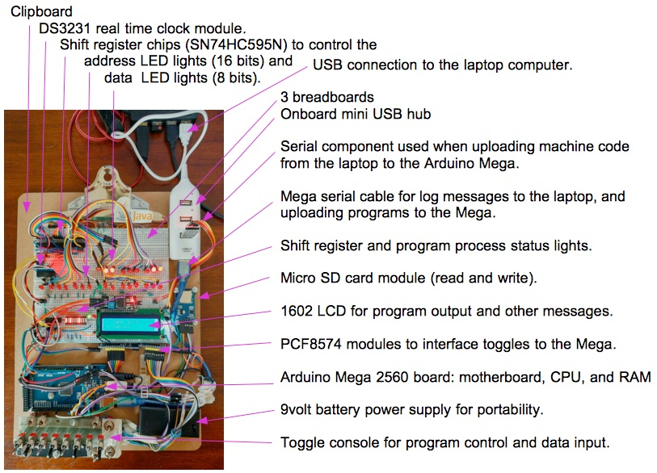

--------------------------------------------------------------------------------
# Assembler program for my Altair 8800 Emulator

My emulator, the Altair 101, as 2 software components:
+ The [machine code processor](../Processor/Processor.ino) emulator program, and
+ This [assembler application](src/asm/).

The processor interprets and processes a subset of the Altair 8800 operational instructions which are Intel 8080 chip opcodes.
The program is written in C++, using the Arduino IDE, and is tested on an Arduino Mega microcontroller.

The assembler is a Java SE application written using my NetBeans IDE.
It parses source code and generates machine code.
It has debugging features: parse listing, program byte listings, and error messages.
Once machine code is generated, the assembler can upload the machine code to an Altair 101 machine.

Assembler components:
+ Command line parsing program: [src/asm/asm.java](src/asm/asm.java).
+ Opcode table of information: [asmOpcodes.txt](asmOpcodes.txt). Lists both implemented and not implemented opcodes.
+ Program to load the opcode table of information into program memory structures: [src/asm/asmOcodes.java](src/asm/asmOpcodes.java).
+ Program to convert source programs into machine code: [src/asm/asmProcessor.java](src/asm/asmProcessor.java).
+ Program to upload machine code to the Altair 101, over a serial port: [src/asm/asmUpload.java](src/asm/asmUpload.java).

#### My Altair 101 development machine:



--------------------------------------------------------------------------------
#### How to Assemble and Run Programs on the Altair 101

Following is how I generate a machine code file and upload it to the Arduino processor program.

1. On my laptop, I generate the machine code file.
````
$ java -jar asm.jar 
+++ Start 8080/8085 assembler, version 0.92e
...
> ls
...
++ opAdd.asm
++ opAdiSui.asm
...
++ pKillTheBit.asm
...
> file pKillTheBit.asm
...
> asm
+ -------------------------------------
+ Print and parse the program: pKillTheBit.asm:
++ parseLine, part1|org| theRest|0|
...
+ Print Program Bytes and description.
++ Address:byte      databyte :hex > description
++       0:00000000: 00100001 : 21 > opcode: lxi h,0
++       1:00000001: 00000000 : 00 > lb: 0
++       2:00000010: 00000000 : 00 > hb: 0
...
++      21:00010101: 11000011 : C3 > opcode: jmp Begin
++      22:00010110: 00001000 : 08 > lb: 8
++      23:00010111: 00000000 : 00 > hb: 0
+ End of list.
+ Machine code file created:  p1.bin
````
The machine code file is created.

2. I upload the file to the 101.

On the Altair 101,
````
I set the sense switches all on.
+ I flip the AUX2 switch down, for download.
+ Now, the machine is ready to receive bytes downloaded through the serial port module.
````

On the laptop, I enter the command to upload the machine code file.
````
> upload
+ -------------------------------------
+ Write to the serial port, the program file: p1.bin:
+ Serial port is open.
+ Write to serial port. Number of bytes: 24 in the file: p1.bin
00100001 00000000 00000000 00010110 10000000 00000001 00000000 00000101 00011010 00011010 
00011010 00011010 00001001 11010010 00001000 00000000 11011011 11111111 10101010 00001111 
01010111 11000011 00001000 00000000 
+ Serial port is closed.

+ Write completed.
> exit
+ -------------------------------------
+++ Exit.
$
````
The machine code is now in the 101's program memory.

On the Altair 101,
````
I flip the RESET switch and the machine returns to program mode.

If I flip the run switch, the program starts running.

I can use the examine and examine next toggle to view the program bytes in the front panel LED lights.
I can change the program bytes using the Deposit toggle.
The Step toggle works to step through the program machine cycles
with results showing on the LED lights: address lights, data lights, and status lights.

Flipping the AUX2 toggle up, the emulator's memory,
which includes the program and memory data, is saved to the micro SD card.
Flipping the AUX2 toggle down, the file bytes are reloaded into memory from the micro SD card.

The micro SD card filenames are set using the address toggles.
For example, set the toggles to 00000101, flip AUX2 toggle up,
and the emulator's memory is stored (uploaded) to file: 00000101.bin.
At any other time, the program can be reloaded into memory by
setting the toggles to 00000101, and flipping AUX2 down,
to download the file, 00000101.bin, back into the emulator's memory.
````

--------------------------------------------------------------------------------
Cheers