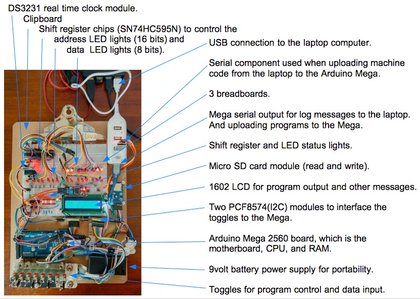

--------------------------------------------------------------------------------
# Assembler program for my Altair 8800 Emulator

My emulator, the Altair 101, as 2 software components:
+ The [machine code processor](../Processor/Processor.ino) emulator program, and
+ The [assembler application](src/asm/).

The processor interprets and processes a subset of the Altair 8800 operational instructions which are Intel 8080 chip opcodes.
The program is written in C++, using the Arduino IDE, and is tested on an Arduino Mega microcontroller.

The assembler is a Java SE application written using my NetBeans IDE.
It parses source code and generates machine code.
It has debugging features: parse listing, program byte listings, and error messages.
Once machine code is generated, the assembler can upload the machine code to an Altair 101 machine.

Assembler components:
+ Command line parsing program: [src/asm/asm.java](src/asm/asm.java).
+ Opcode table of information: [asmOpcodes.txt](asmOpcodes.txt).
+ Program to load, and use, the opcode table of information: [src/asm/asmOcodes.java](src/asm/asmOpcodes.java).
+ Program to convert source programs into machine code: [src/asm/asmProcessor.java](src/asm/asmProcessor.java).
+ Program to upload machine code to the Altair 101, over a serial port: [src/asm/asmUpload.java](src/asm/asmUpload.java).

#### My Altair 101 development machine:



--------------------------------------------------------------------------------
#### How to Assemble and Run Programs on the Altair 101

Following is how I generate a machine code file and upload it to the Arduino processor program.

On the Altair 101,
````
I set the sense switches all on.
+ Now, the machine is ready to receive bytes through the serial port module.
````
On my laptop, I generate the machine code file.
````
$ java -jar asm.jar 
+++ Start 8080/8085 assembler, version 0.92e
...
> ls
...
++ opAdd.asm
++ opAdiSui.asm
...
++ pKillTheBit.asm
...
> file pKillTheBit.asm
...
> asm
+ -------------------------------------
+ Print and parse the program: pKillTheBit.asm:
++ parseLine, part1|org| theRest|0|
...
+ Print Program Bytes and description.
++ Address:byte      databyte :hex > description
++       0:00000000: 00100001 : 21 > opcode: lxi h,0
++       1:00000001: 00000000 : 00 > lb: 0
++       2:00000010: 00000000 : 00 > hb: 0
...
++      21:00010101: 11000011 : C3 > opcode: jmp Begin
++      22:00010110: 00001000 : 08 > lb: 8
++      23:00010111: 00000000 : 00 > hb: 0
+ End of list.
+ Machine code file created:  p1.bin
````
The machine code file is created. Next I upload the file.
````
> upload
+ -------------------------------------
+ Write to the serial port, the program file: p1.bin:
+ Serial port is open.
+ Write to serial port. Number of bytes: 24 in the file: p1.bin
00100001 00000000 00000000 00010110 10000000 00000001 00000000 00000101 00011010 00011010 
00011010 00011010 00001001 11010010 00001000 00000000 11011011 11111111 10101010 00001111 
01010111 11000011 00001000 00000000 
+ Serial port is closed.

+ Write completed.
> exit
+ -------------------------------------
+++ Exit.
$
````
On the Altair 101,
````
I flip the RESET switch and the machine returns to program mode.
````
The machine code program is in the emulator's memory and ready to use.
For example, I flip the run toggle to run the program.

I can use the examine and examine next toggles to view the program bytes in the front panel LED lights.
I can change the program bytes using the Deposit toggles.
The Step toggle works to step through the program machine cycles
with results showing on the LED lights: address lights, data lights, and status lights.

Flipping the AUX2 toggle up, the emulator's memory,
which includes the program and memory data, is saved to the micro SD card.
Flipping the AUX2 toggle down, the file bytes are reloaded into memory from the micro SD card.

The micro SD card filenames are set using the address toggles.
For example, set the toggles to 00000101, flip AUX2 toggle up,
and the emulator's memory is stored (uploaded) to file: 00000101.bin.
At any other time, the program can be reloaded into memory by
setting the toggles to 00000101, and flipping AUX2 down,
to download the file, 00000101.bin, back into the emulator's memory.

--------------------------------------------------------------------------------
## Implemented Opcodes

The following list was generated from the [opcode data file](asmOpcodes.txt).
````
Binary             Opcode   Binary   Cycles Description
-------------------------------------
11000110 : adi   : ADI #    11 000 110  3  Add #(immediate value) to register A, set: ZSCPA.
11100110 : ani   : ANI #    11 100 110  2  AND #(immediate value) with register A.
11001101 : call  : CALL a   11 001 101  3  Unconditional subroutine call. Push current address onto the stack and jump the subroutine address.
10111SSS : cmp   : CMP S    10 111 SSS  1  Compare register(S: B,C,D,E,H,L, or M) with register A, then set flags. If S==A, ZeroBit=1 & CarryBit=0. If S!=A, ZeroBit=0. If S>A, CarryBit=1. If S<A, CarryBit=0.
11111110 : cpi   : CPI #    11 111 110  2  Compare #(immediate value) to A. If #==A, ZeroBit=1 & CarryBit=0. If #!=A, ZeroBit=0. If #>A, CarryBit=1. If #<A, CarryBit=0.
00RP1001 : dad   : DAD RP   00 RP1 001  1  16 bit add. Add register pair(RP: B:C or D:E) to H:L, into H:L. And set carry bit.
00DDD101 : dcr   : DCR D    00 DDD 101  1  Decrement a register DDD(A,B,C,D,E,H, or L). To do, set flags: ZSPA.
00RP1011 : dcx   : DCX RP   00 RP1 011  1  Decrement a register pair value(16 bit value): B:C, D:E, H:L.
01110110 : hlt   : HLT      01 110 110  1  Halt processor.
11011011 : in    : IN pa    11 011 011  2  Read port a data into the accumulator. Example, a=0377 is the sense switches.
00DDD100 : inr   : INR D    00 DDD 100  1  Increment register DDD(A,B,C,D,E,H, or L). To do, set flags: ZSPA.
00RP0011 : inx   : INX RP   00 RP0 011  1  Increment a register pair value(16 bit value): B:C, D:E, H:L. To do: increment the stack pointer.
11011010 : jc    : JC a     11 011 010  3  Jump to a, if Carry bit flag is set (equals 1).
11000011 : jmp   : JMP a    11 000 011  3  Unconditional jump to address a.
11010010 : jnc   : JNC a    11 010 010  3  Jump to a, if Carry bit flag is not set (equals 0).
11000010 : jnz   : JNZ a    11 000 010  3  Jump to a, if Zero bit flag is not set (equals 0).
11001010 : jz    : JZ a     11 001 010  3  Jump to a, if zero bit flag is set (equals 1).
00111010 : lda   : LDA a    00 111 010  3  (adr) -> A: Load register A with data from the address, a(lb:hb).
00RP1010 : ldax  : LDAX RP  00 RP1 010  1  Load data value at the register pair address (B:C(RP=00) or D:E(RP=01)), into register A.
00101010 : lhld  : LHLD a   00 101 010  3  (adr)->L;(adr+1)->H: Load registers H and L (H:L) with address values a and a+1.
00RP0001 : lxi   : LXI RP,a 00 RP0 001  3  byte3(hb)->R,byte2(lb)->P:Move the address, a(lb:hb), into register pair: B:C, D:E, or H:L. To do: move data to the stack pointer address.
01DDDSSS : mov   : MOV D,S  01 DDD SSS  1  Move source register(SSS) data, to the destination(DDD) register(A,B,C,D,E,H, or L). If source(S) is M(110), move data from address H:L(H is hb,L is lb), to destination(D).
00RRR110 : mvi   : MVI R,#  00 RRR 110  2  Move #(immediate value) to a register (R).
00000000 : nop   : NOP      00 000 000  1  No operation. I added a delay: delay(100).
10110SSS : ora   : ORA S    10 110 SSS  1  OR register S, with register A.
11100011 : out   : OUT pa   11 010 011  2  Write the accumulator data out to port a. I'm using this opcode to write custom log messages such as echoing the registers.
11RP0001 : pop   : POP RP  11 RP0 001  1  Pop a register pair (RP) from the stack: B:C, D:E, H:L. To do, pop flags.
11RP0101 : push  : PUSH RP  11 RP0 101  1  Push a register pair (RP) onto the stack: B:C, D:E, H:L. To do, push flags.
11001001 : ret   : RET      11 001 001  1  Unconditional return from subroutine. Pop the call address from the stack and continue to the next address.
00000111 : rlc   : RLC      00 000 111  1  Rotate accumulator left by shift left 1 bit, and wrapping the first bit to the last position. Need to handle carry bit (CY = prev bit 7).
00001111 : rrc   : RRC      00 001 111  1  Rotate accumulator right by shift right 1 bit, and wrapping the last bit to the first position. Need to handle carry bit (CY = prev bit 0).
00100010 : shld  : SHLD a   00 100 010  3  L->(adr);H->(adr+1): Store register data values to memory locations: register L a(address hb:lb). Store register H to: a + 1.
00110010 : sta   : STA a    00 110 010  3  A -> (adr): Store register A to the address, a(lb:hb), lowbyte followed by the highbyte.
11010110 : sui   : SUI #    11 010 110  3  Subtract #(immediate value) from register A, set ZSCPA.
10101SSS : xra   : XRA R    10 101 SSS  1  Exclusive OR, the register(R) with register A.
````
--------------------------------------------------------------------------------
Cheers