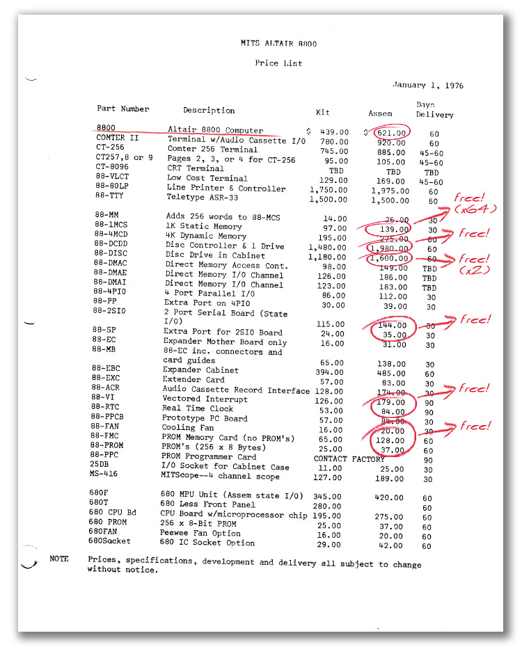
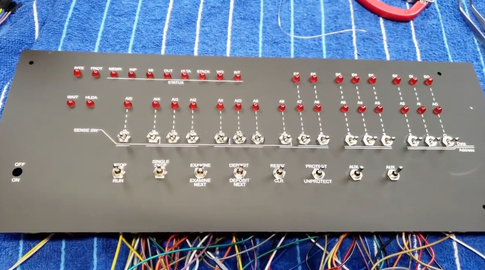
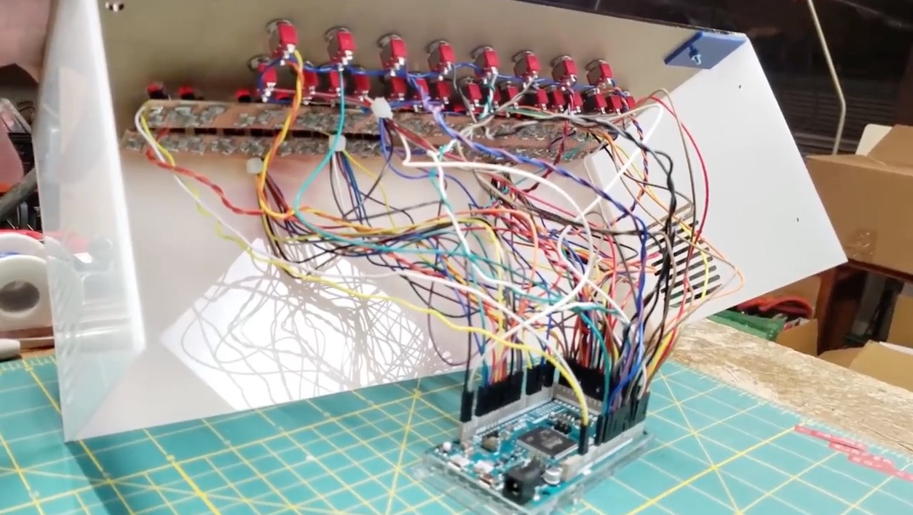

--------------------------------------------------------------------------------
# Altair 101 Build Plan

The build starts with an [Altair 8800 clone front panel](https://www.adwaterandstir.com/product/front-panel/).

The target was to keep the cost of parts under $100.
The cost of the clone front panel, sticker, and standard case, was $74, which doesn't leave much for the electronics.
With the electronic parts, mostly from China, the total is $101.
Wow, $101. An auspicious cost for an Altair 101.

[](https://altairclone.com/ordering.htm)

My Altair 101 parts listed [below](https://github.com/tigerfarm/arduino/tree/master/Altair101/build#altair-101-parts-list).

In the following video, the person is building an Altair 8800 Replica using a similar strategy to what I'm using.
https://www.youtube.com/watch?v=zqRILp6srBk&t=830s

Their steps,
+ Adds toggles and LEDs to his Altair 8800 clone front panel,
+ Puts the completed front panel into his case.
+ Wires the front panel components to his Arduino Duo.
+ I'm going to use an Arduino Nano with other components on breadboards.
+ With the parts connected, ran a test.
+ Completed by putting the case together with the electronics enclosed.

[](https://www.youtube.com/watch?v=zqRILp6srBk&t=830s)

[](https://www.youtube.com/watch?v=zqRILp6srBk&t=830s)

[](https://www.youtube.com/watch?v=zqRILp6srBk&t=830s)

[](https://www.youtube.com/watch?v=zqRILp6srBk&t=830s)

[](https://www.youtube.com/watch?v=zqRILp6srBk&t=830s)

[](https://www.youtube.com/watch?v=zqRILp6srBk&t=830s)

[](https://www.youtube.com/watch?v=zqRILp6srBk&t=830s)

[](https://www.youtube.com/watch?v=zqRILp6srBk&t=830s)

[](https://www.youtube.com/watch?v=zqRILp6srBk&t=830s)

[](https://www.youtube.com/watch?v=zqRILp6srBk&t=830s)

[](https://www.youtube.com/watch?v=zqRILp6srBk&t=830s)

[](https://www.youtube.com/watch?v=zqRILp6srBk&t=830s)

--------------------------------------------------------------------------------
### Front Panel I/O Hardware Boards

Build a toggle input test board:
+ 4 input toggles for 4 data bits.
+ 2 input On/Off/On momentary toggles for to control 4 data bit settings.
+ Use 3 Nano pins. Use a chip or board to Expand Digital Inputs.
+ Test using a 74HC595 Shift Register
+ Test with a PCF8574 board

Build an 8 LED output test board:
+ Use 3 pins of a Nano board
+ 74HC595 Shift Register
+ 1 LED bar-graph (10 LEB bars) and 8 resistors.

https://www.youtube.com/watch?v=cAT07gy4DII

The development Altair 101 will,
+ Use 3 Nano pins to turn the LEDs on and off.
+ 1 x 74HC595 Shift Register, 8 data LEDs, resistors
+ 2 x 74HC595 Shift Register, 16 address LEDs, resistors
+ Use 1 Nano pin for 1 LED to display that the computer is in the WAIT state or not. When power is first turned on, the WAIT LED comes on.
+ Final computer will also have a HLT LED and 10 operational LEDs, for a total of 36 LEDs (8+16+1+1+10).

Note, using 74HC595 chips or a PCF8574 board, power them from outside the Nano.
This means there is plenty of power to run the chips and LEDs.
+ +5V to Nano 5V.
+ Ground to Nano ground.
+ +5V and ground to each 74HC595.
+ Not powering the 74HC595 and LEDs from the Nano +5V pin when the power comes into the Nano from the USB port.
+ Using the +5V pin when the power comes into the Nano from the USB port, will be okay to build a single 74HC595 chip test board.

--------------------------------------------------------------------------------
### Front Panel Cable Required for My Build

Male to Male Ribbon Cables
+ 1 power toggle:
    2 x 20cm Male to Male Ribbon
+ 16 address toggles:
    16 x 20cm Male to Male Ribbon for control + 1 x 20cm Male to Male Ribbon for input into 74HC595
    15 x 10cm Male to Male Ribbon for ground connection from one toggle to the next + 1 x 20cm Male to Male Ribbon to ground
+ 8 control (16 on/off) on/off/on momentary toggles: 
    16 x 20cm Male to Male Ribbon for control + 1 x 20cm Male to Male Ribbon for input into 74HC595
     7 x 10cm Male to Male Ribbon for ground connection from one toggle to the next + 1 x 20cm Male to Male Ribbon to ground
+ LEDs: 8 data + 16 address:
    24 x 20cm Female to Male Ribbon for control + 1 x 20cm Female to Male Ribbon for input into 74HC595
    23 x 10cm Female to Female Ribbon for ground connection from one LED to the next + 1 x 20cm Female to Male Ribbon to ground
+ LEDs: 2 state + 8 status:
    10 x 20cm Female to Male Ribbon for control + 1 x 20cm Female to Male Ribbon for input into 74HC595
     9 x 10cm Female to Female Ribbon for ground connection from one LED to the next + 1 x 20cm Female to Male Ribbon to ground
+ LED: 2 x on/off (WAIT + HLDA):
     4 x 20cm Female to Male Ribbon for control + 1 x 20cm Female to Male Ribbon for input into 74HC595

Totals:
+ Toggles: 20cm Male to Male Ribbon:
    2 + 18 + 18
+ Toggles: 10cm Male to Male Ribbon:
    0 + 15 +  7
+ LEDs: 20cm Female to Male Ribbon:
    26 + 12 + 4
+ LEDs: 10cm Female to Female Ribbon:
    23 +  9 + 0
+ 20cm Male to Male Ribbon: 38
+ 10cm Male to Male Ribbon: 22
+ 20cm Female to Male Ribbon: 42
+ 10cm Female to Female Ribbon: 32

--------------------------------------------------------------------------------
#### LED Outputs

Build an LED output test board:
+ 8 LEDs for data bits.
+ 3 Nano pins, 74HC595 Shift Register, resistors, 1 LED bar for testing.

https://www.youtube.com/watch?v=cAT07gy4DII

Altair 101 breadboards for 36 LEDs (2+8+16+10):
+ 1 Nano
+ Use 3 Nano pins to turn the LEDs on and off.
+ 8 data LEDs, 3 Nano pins,
    1 x 74HC595 Shift Register, resistors
+ 16 address LEDs, 3 Nano pins,
    2 x 74HC595 Shift Register, resistors
+ 8 operational LEDs to display with the computer is in WAIT or not,
    1 x 74HC595 Shift Register, resistors

Using 74HC595 chips, means there is plenty of power to run the LEDs.

--------------------------------------------------------------------------------
#### Toggle switch Inputs

I need to work out a method for reading toggles:
+ Memory address and data toggles to set on or off.
+ On/Off/On momentary toggles which are momentarily flipped, verses toggle set on or off.

Build an input test board:
+ 4 input toggles for 4 data bits.
+ 2 input On/Off/On momentary toggles for to control 4 data bit settings.
+ Use 3 Nano pins. Use a chip or board to Expand Digital Inputs.
+ Test using a 74HC595 Shift Register
+ Test using a 74HC165 parallel to serial chip
+ Test with a PCF8574 board

Altair 101 board for 25 toggles (1+16 toggles + 8 momentary toggles):
+ 1 Nano
+ Use 3 Nano pins for reading the 16 input sense switches (address/data toggles), 
    2 x 74HC595 Shift Register or use 2 Port Extender boards: PCF8574?
+ Use 3 pins for reading On/Off/On momentary toggles. Each toggle has 2 settings.
+ To start, need 2 On/Off/On momentary toggles for Examine/Examine and Next/Deposit Next,
    1 x 74HC595 Shift Register, 4 bits total.
+ 1 On/Off/On momentary toggle for Reset and CLR (clear),
    which is 2 more bits on the above 595.

https://www.ebay.com/itm/5-x-74HC165-74165-IC-8-BIT-SHIFT-REGISTER-FREE-SHIPPING/251118499363
https://www.ebay.com/itm/10pcs-74HC165-SN74HC165N-8-Bit-Parallel-Load-Shift-Registers-DIP-16/181847051341

--------------------------------------------------------------------------------
### Altair 101 Parts List

Parts list from a clone:
https://www.hackster.io/david-hansel/arduino-altair-8800-simulator-3594a6

+ Front panel, sticker, case, and shipping = $74
+ Nano + on/off/on momentary toggles + on/off toggles + red LEDs
+ 20pcs 74HC595 + pin expander module PCF8574
+ Breadboards + cables
+ Total = $101 = $74 + $3 + $7 + $2 + $2 + $3 + $6 + $4

+ Ordered Altair 8800 Front panel with sticker, standard case, and shipping: $74
https://www.adwaterandstir.com/product/front-panel/
````
Order number: 11282
Date: October 22, 2019
Altair 8800 Front panel: $18.00	
Altair 8800 Front Panel Sticker: $5.00
Shipping: $13.00
````
+ After paying for the order, I communicated with the manufacturer and ordered the regular case: $38 = $35 + $3.10 shipping.
+ Total: $74

+ Nano
https://www.ebay.com/itm/MINI-USB-Nano-V3-0-ATmega328P-CH340G-5V-16M-Micro-controller-board-for-Arduino/383093281539

+ SPDT On/Off/On 3 Position Momentary toggles, Diameter: 6mm (0.2inch), Micro mini, 10pcs for $6.79
https://www.ebay.com/itm/10pcs-Red-3-Pin-3-Position-ON-OFF-ON-SPDT-Micro-Mini-Momentary-Toggle-Switch/223490809691

+ SPDT On/On 2 Position Mini Toggle Switch, 10Pcs for $2.68
https://www.ebay.com/itm/10Pcs-AC-250V-1-5A-125V-3A-SPDT-3-Pin-On-On-2-Position-Mini-Toggle-Switch-Blue/272882765795

+ Red LED 5mm, 100pcs for $1.50
https://www.ebay.com/itm/100Pcs-LED-Lights-Emitting-Diodes-Lamp-Parts-3mm-5mm-for-Electronics-Arduino-DIY/202692215007?var=502802895935

+ 220Ω, 470Ω, 560Ω, 1k, or 3k resistors?
+ Need to test to get the right ohms for brightness and wattage for physical size.
+ Use A09 Network Resistor 9-pin module?

+ Shift Register SN74HC595N, 20pcs for $2
https://www.ebay.com/itm/5-10-20pcs-Chip-Stable-2-0-6-0-V-74HC595-8-Bit-IC-Shift-Register-SN74HC595N/173212029799?var=471929852731

+ 10uf capacitor across positive and ground when using chips: SN74HC595N.

Cables on order,
+ 1 x 40pcs/pack 20cm Male to Male Ribbon Breadboard Cable
+ 1 x 40pcs/pack 10cm Male to Male Ribbon Breadboard Cable
+ 2 x 40pcs/pack 20cm Female to Male Ribbon Breadboard Cable
+ 1 x 40pcs/pack 10cm Female to Female Ribbon Breadboard Cable
+ 140pcs Solderless Breadboard Jumper Cable Wire Kit Box, $2.46

----------------
#### Parts to test

+ GPIO Port Extenders chip: PCF8574 should work for toggles.

+ An option to consider, is addressable LEDs that come on strips.
+ Arduino – Controlling a WS2812 LED strand with NeoPixel or FastLED
https://www.tweaking4all.com/hardware/arduino/arduino-ws2812-led/

--------------------------------------------------------------------------------
### Reference Links

+ How to build one.
https://www.hackster.io/david-hansel/arduino-altair-8800-simulator-3594a6
+ Build your own.
https://spectrum.ieee.org/geek-life/hands-on/build-your-own-altair-8800-personal-computer
+ About, with parts list
https://www.hackster.io/david-hansel/arduino-altair-8800-simulator-3594a6

+ Assembled & Tested, $279.95 – $349.95
https://www.adwaterandstir.com/product/altair-assembled/

Google forums:
https://groups.google.com/forum/#!forum/altair-duino

+ Altair 8800 Clone, Ordering Information, (assembled) $621
https://altairclone.com/ordering.htm

+ Getting started with the Arduino Due
https://www.arduino.cc/en/Guide/ArduinoDue
+ The Arduino Due is a microcontroller board based on the Atmel SAM3X8E ARM Cortex-M3 CPU.
+ It is the first Arduino board based on a 32-bit ARM core microcontroller.
+ The microcontroller mounted on the Arduino Due runs at 3.3V
+ 54 digital input/output pins, 12 analog inputs
+ Uses CH340G drivers
+ DUE R3 Board SAM3X8E 32-bit ARM Cortex-M3 Control Board Module For Arduino, US $14.64
https://www.ebay.com/itm/DUE-R3-Board-SAM3X8E-32-bit-ARM-Cortex-M3-Control-Board-Module-For-Arduino/141976885203
+ Intro to the Arduino Due
https://www.theengineeringprojects.com/2018/09/introduction-to-arduino-due.html
+ Uses the Arduino Due which is an Arduino for more powerful larger scale projects.
https://store.arduino.cc/usa/due
++ The Arduino Due is the first Arduino board based on a 32-bit ARM core microcontroller.
++ 54 digital input/output pins, 12 analog inputs, a 84 MHz clock

--------------------------------------------------------------------------------
Cheers