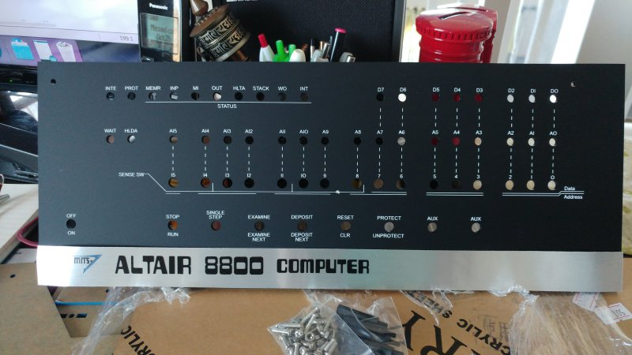
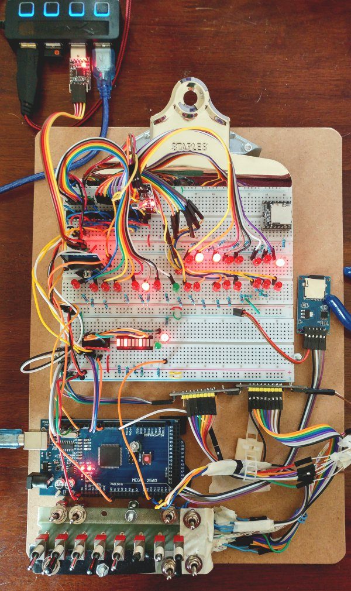
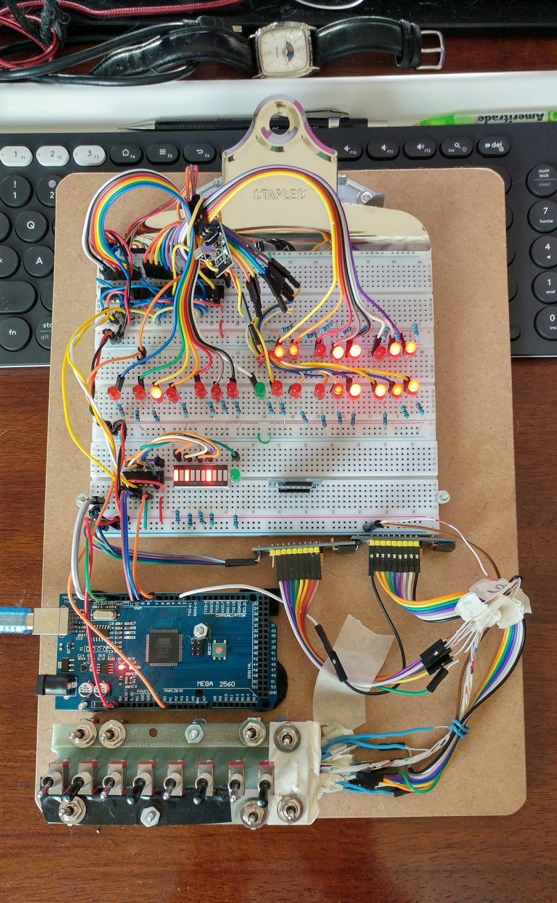
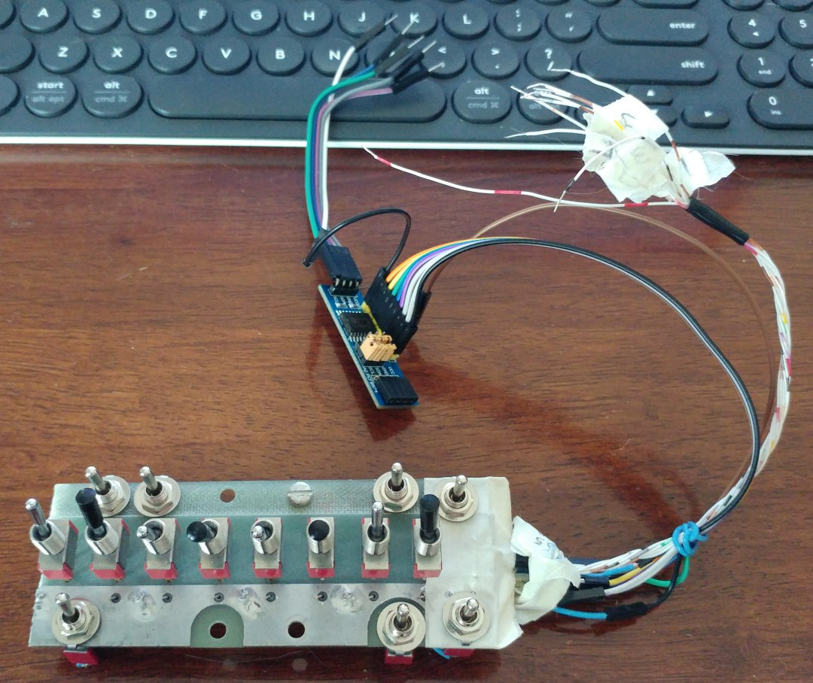
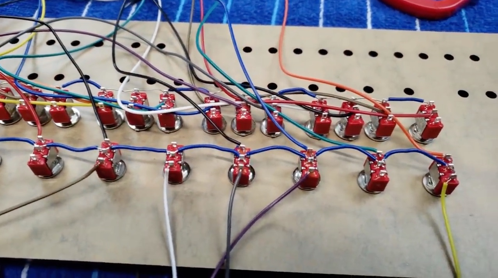
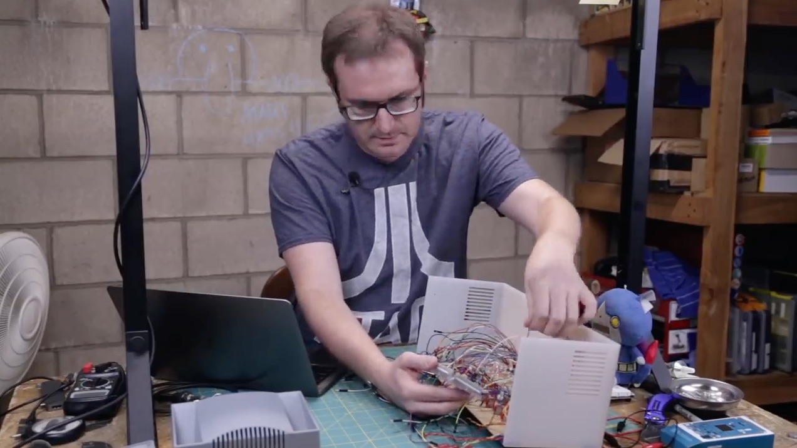
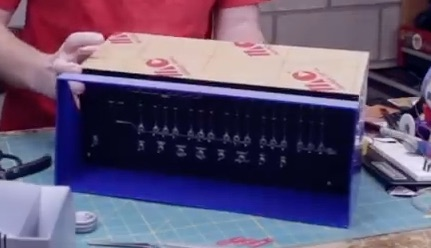

--------------------------------------------------------------------------------
# Altair 101 Build Plan

Your mobile phone has a touch screen display. Your computer has a keyboard and monitor.
In 1975, the first available popular computer only had toggles and lights.
It was the Altair 8800 which launch the home computer revolution.
As I want a similar computer, I designed my Altair 101 to have a front panel of toggles and LED lights.

My goal is to design and build an Altair 8800 emulator, to emulate the base Altair 8800 machine.
The emulator machine will also have modern components such as a micro SD card module and a real time clock.
I will keep the cost low. My original target was $99, but the final machine will closer to $129.

Most clones, replicas, use an Arduino Due.
I started with an Arduino Nano, which was only $3 each.
However, due to increasing memory requirements, I moved to the Mega 2560 (ATmega2560), about $12 each.

As I want to keep soldering to minimum, and a simplistic build.
Where others designed and printed a PCB board, I'm using breadboards.
I got the idea of building a computer on breadboards from Dan Eater's videos on 
[how to Build an 8-bit computer from scratch](https://www.youtube.com/watch?v=HyznrdDSSGM&list=PLLlz7OhtlfKYk8nkyF1u-cDwzE_S0vcJs&index=14)

I have completed a dev machine. I'm refining, tuning, and testing it.
The components are mounted on a clipboard which makes it a steampunk tablet.
The desktop model design will be based on the tablet machine.
The major difference between the machines, is that the tablet model has 8 address toggles where the desktop model will have 16 address toggles.

My hardware design centers around my [Altair 8800 clone front panel](https://www.adwaterandstir.com/product/front-panel/).

[](https://www.adwaterandstir.com/product/front-panel/)

--------------------------------------------------------------------------------
## The Altair 101 Steampunk Tablet

The processor software runs on an Arduino Mega.
I moved to the Mega when I started to run out memory (RAM) on Nano.



Top left is USB hub:
+ Plugs into my laptop.
+ Plugs into the Mega for uploading programs and serial monitoring.
+ Serial port module for downloading byte code to the Mega where the code goes into the emulator's memory.

Top breadboard, in the following photo of the current development machine:
+ Cables connecting 3 shift registers(SN74HC595N) to the LED lights in the center board.
+ In the middle of the cables is the infrared receiver.
    It was used in the early development phase, in place of toggle switches such as stop, run, examine, deposit.
+ MP3 player module. Not yet connected.

Center breadboard:
+ DS3231 clock module (left above the LED lights).
+ Display LED lights: 16 address and 8 data lights.

Bottom breadboard:
+ Shift register(SN74HC595N) to the status LED lights.
+ The I2C pins from the Mega are connected here, to allow multiple devices to connect.
    Currently, the input toggles are I2C connected.

Right of the breadboards:
+ Micro SD Card module for reading and writing program memory.

Below the breadboards:
+ Arduino Mega board which is the Altair 101's CPU and RAM.
+ Input toggles for entering address and data.
    The toggle board is from a 1970's mainframe computer.
+ Control toggles arranged on the 70's toggle board, in the fashion of a game console.

--------------------------------------------------------------------------------
### Altair 101 Steampunk Tablet Parts List

+ Front panel, sticker, case, and shipping = $18.00 + $5 + $35 + $16 = $74
+ Nano + on/off/on momentary toggles + on/off toggles + red LEDs = $3 + $7 + $2 + $2
+ 20pcs 74HC595 + diodes for input = $2 + $1
+ Breadboards + cables = $6 + $4
+ Total = $101 = $74 + $3 + $7 + $2 + $2 + $2 + $1 + $6 + $4

+ Ordered Altair 8800 Front panel with sticker, pro case, and shipping: $74
https://www.adwaterandstir.com/product/front-panel/

Parts bought on eBay,
+ Nano: V3, ATmega328P, CH340G
+ SPDT On/Off/On 3 Position Momentary toggles, Diameter: 6mm (0.2inch), Micro mini, 10pcs for $6.79
+ SPDT On/On 2 Position Mini Toggle Switch, Diameter: 6mm (0.2inch), 10Pcs for $2.68
+ Red LED 5mm, 100pcs for $1.50
+ 5k resistors for LED lights.
+ 10k resistors for Nano digital pin pull down.
+ Switching Diodes: 40PCS for $1, 1N4148 IN4148
+ Shift Register SN74HC595N, 20pcs on sale for $2
+ Suggested, not used: 10uf capacitor across positive and ground when using chips: SN74HC595N.

Cables on order,
+ 1 x 40pcs/pack 10cm Male to Female Ribbon Breadboard Cable
+ 1 x 40pcs/pack 10cm Female to Female Ribbon Breadboard Cable

For reference, I used the following parts list from a simulator:
https://www.hackster.io/david-hansel/arduino-altair-8800-simulator-3594a6

--------------------------------------------------------------------------------
## Mega 2560 Board Pin Usage

The original Intel 8080 cpu was a 40 pin chip.
The Mega has 16 analog pins, 52 GIPO pins, and other pins such as +5V and ground.
````
PIN = A1    Infrared Receiver

AUX Control toggle switch pins:
CLOCK_SWITCH_PIN =    A11;
PLAYER_SWITCH_PIN =   A12;
UPLOAD_SWITCH_PIN =   A13;
DOWNLOAD_SWITCH_PIN = A14;

Control (STOP, RUN, ...) toggle switch interrupt pin for the PCF8574.
INTERRUPT_PIN = 2;

Output LED light shift register(SN74HC595N) pins
dataPinLed = 7;     // pin 14 Data pin.
latchPinLed = 8;    // pin 12 Latch pin.
clockPinLed = 9;    // pin 11 Clock pin.

HLDA_PIN = A10;     // Emulator processing (off/LOW) or clock processing (on/HIGH).

Serial module pins:
PIN_RX = 12;  // Arduino receive is connected to TXD on the serial module.
PIN_TX = 11;  // Arduino transmit is not used, and therefore not connected to RXD pin on the serial module.

//     Mega - Micro SD Card, SPI module pins
// Pin 53   - CS   : chip/slave select (SS pin). Can be any master(Nano) digital pin to enable/disable this device on the SPI bus.
// Pin 52   - SCK  : serial clock, SPI: accepts clock pulses which synchronize data transmission generated by Arduino.
// Pin 51   - MOSI : master out slave in, SPI: input to the Micro SD Card Module.
// Pin 50   - MISO : master in slave Out, SPI: output from the Micro SD Card Module.
// Pin 5V+  - VCC  : can use 3.3V or 5V
// Pin GND  - GND  : ground
````
--------------------------------------------------------------------------------
## Older Altair 101 Development Machines

First version mounted on a clipboard.



In the following, the previous version used a Nano on the bottom breadboard.
It also used buttons for control that were joined to the Nano using Shift registers(SN74HC595N).


The early development machine had only infrared remote control instead of toggle switches.
I was also testing with a 1602 LCD. Including an LCD was shelved for the time
because I'm using serial log messages while developing.


With the first machine, I thought I could use an SD card module for saving and storing programs.
I soon realized that functionality was a long way off.
I did use buttons, but later found that infrared remote control was quicker for early development.


--------------------------------------------------------------------------------
### Altair 101 Parts List

+ Front panel, sticker, case, and shipping = $18.00 + $5 + $35 + $16 = $74
+ Nano + on/off/on momentary toggles + on/off toggles + red LEDs = $3 + $7 + $2 + $2
+ 20pcs 74HC595 + diodes for input = $2 + $1
+ Breadboards + cables = $6 + $4
+ Total = $101 = $74 + $3 + $7 + $2 + $2 + $2 + $1 + $6 + $4

+ Ordered Altair 8800 Front panel with sticker, pro case, and shipping: $74
https://www.adwaterandstir.com/product/front-panel/

Parts bought on eBay,
+ Nano: V3, ATmega328P, CH340G
+ SPDT On/Off/On 3 Position Momentary toggles, Diameter: 6mm (0.2inch), Micro mini, 10pcs for $6.79
+ SPDT On/On 2 Position Mini Toggle Switch, Diameter: 6mm (0.2inch), 10Pcs for $2.68
+ Red LED 5mm, 100pcs for $1.50
+ 5k resistors for LED lights.
+ 10k resistors for Nano digital pin pull down.
+ Switching Diodes: 40PCS for $1, 1N4148 IN4148
+ Shift Register SN74HC595N, 20pcs on sale for $2
+ Suggested, not used: 10uf capacitor across positive and ground when using chips: SN74HC595N.

Cables on order,
+ 1 x 40pcs/pack 10cm Male to Female Ribbon Breadboard Cable
+ 1 x 40pcs/pack 10cm Female to Female Ribbon Breadboard Cable

For reference, I used the following parts list from a simulator:
https://www.hackster.io/david-hansel/arduino-altair-8800-simulator-3594a6

--------------------------------------------------------------------------------
### Toggle Console Keyboard

````
The toggle keyboard will replace the current breadboard buttons,
and will continue to use the current toggles.
+ Current 8 toggles are for address and data entry. Also used as sense switches for input.
++ Only 8 are required because of the limited 256 bytes of memory.
+ Added 7 x on/off/on toggles for controls,
++ 1. STOP and RUN
++ 2. SINGLE STEP. Maybe add: Examine previous
++ 3. EXAMINE and EXAMINE NEXT
++ 4. DEPOSIT and DEPOSIT NEXT
++ 5. RESET. Not implemented: CLR, clear external I/O equipment.
++ 6. AUX 1, maybe to switch from computer processing to clock display on the LED lights.
              Or switch to MP3 player.
++ 7. AUX 2, for save and load from SD card.

Keyboard layout, where 'O' is the bolt to connect the keyboard to the clipboard.
   ------------------------------------
  |  1      2       O        3      4  |
  |                                    |
  |   A7  A6  A5  A4  A3  A2  A1  A0   |
  |                                    |
  |  5                       6      7  |
   ------------------------------------
````
The console on/off/on switches are connected to an I2C PCF8574 module.
The PCF8574 simplifies the wiring.
The current dev machine has another PCF8574 for the A0...A7 toggles.



--------------------------------------------------------------------------------
## Nano Board Pin Usage

The original Intel 8080 cpu was a 40 pin chip.
I'm use a Nano which as 30 pins.
````
                           -----
                       ---| USB |---
 SD card: SPI bus D13 |   |     |   | D12 SPI bus: SD card
                  3V3 |   |     |   | D11 SPI bus: SD card
                  REF |    -----    | D10 SD card SPI enable/disable
  Address toggles  A0 |             | D9  Address toggles
Infrared receiver  A1 |             | D8  Address toggles
                   A2 |             | D7  Address toggles
                   A3 |             | D6  Front panel LED lights
          I2C bus  A4 |             | D5  Front panel LED lights
          I2C bus  A5 |             | D4  Front panel LED lights
                   A6 |             | D3  
                   A7 |             | D2  
                   5V |             | GND Join with external power ground
                  RST |             | RST
                  GND |             | RX0 Used for Serial communications
                  VIN |             | TX1 Used for Serial communications
                       -------------

RX0 and TX1 is used to receive program and output Serial.print() messages.
D2 and D3 are Digital interrupt pins. Not in use at this time.
A0 to A3 can be used as digital pins.
I/O devices:
+ SD card:  SPI bus + a digital enable pin.
+ Clock:    12C bus
+ 1602 LCD: 12C bus 
+ DFPlayer: 2 digital pins.
+ 4 x 7-segment digits: 2 digital pins.
+ SRAM 32K: SPI bus + a digital enable pin. A future option.
+ Rotary encoder: 1 digital pin and an interrupt pin.
````

External memory:
+ External I2C EEPROM to Arduino [24LC256](http://www.hobbytronics.co.uk/arduino-external-eeprom),
    256kbit which is 32kbytes.
+ [PCF8570P](https://arduino-related.livejournal.com/1414.html) I2C 2Kb SRAM (static low-voltage RAM)
+ 23LC512: SPI interface, uses 5V, and has 64 kilobytes of SRAM.
https://www.instructables.com/id/Interface-an-SRAM-bus-to-your-arduino/

DS3231 clock module has a 4K byte (32 kilobits) EEPROM chip, accessible through I2C.
+ The only issue is that EEPROM is made for a lot of read/writes.
I read, "EEPROM chips are only good for a million rewrites," which is okay for saving and loading programs.

--------------------------------------------------------------------------------
#### About the Arduino Boards

+ Nano [Memory](https://www.arduino.cc/en/tutorial/memory):
````
    FLASH 32K bytes (of which .5k is used for the bootloader),
    SRAM   2K bytes,
    Flash program memory = 32K - 2K = 30K
````
+ The ATmega2560 in the Mega2560 has larger memory space:
````
    FLASH  256K bytes (of which 8k is used for the bootloader)
    SRAM   8K bytes
````

--------------------------------------------------------------------------------
### Component Integration Testing

+ The PCF8574(I2C) works fine with the LCD(I2C), clock(I2C)
+ The SD card module works fine standalone.

Component Memory Requirements
````
Flash program storage requirements:
  30720 : Nano bytes available, 30K
   8042 : Processor.ino
   8528 : Clock module
   6720 : LCD module
  13538 : SD card module
  46828 : Total for all components, 46K
        
SRAM requirements:
   2048 : Nano bytes available, 2K
   1332 : Processor.ino
    554 : LCD module
   1886 : Processor + LCD Subtotal
    690 : Clock module
   2022 : Processor + Clock Subtotal
   1304 : SD card module
   3880 : Total for all components, 4K
````

Microcontroller Specifications
````
Microcontroller  Processor   CPU Speed Analog In  Digital IO/PWM  SRAM  Flash  Program Memory
Nano             ATmega328P  16 MHz     8         14/6            2K     32K    32 - 2 =  30K
Mega 2560        ATmega2560  16 MHz    16         54/15           8K    256K   256 - 8 = 248K
````

--------------------------------------------------------------------------------
### Hardware Inventory

+ Few Nano boards
+ Few clock boards
+ Few DFPlayer (MP3) boards

Cables that I have for connections:
+ 20cm cables: 80 male to male
+ 20cm cables: 80 male to female
+ 20cm cables: 40 female to female
+ 10cm cables: 30 male to female

--------------------------------------------------------------------------------
### Hardware to Nano details

Hardware component requirements:
+ Nano board: CPU, program 30K RAM, 2K dynamic RAM.
+ 8 x SN74HC595N chips. Development machine only uses 7, 1 less because only using 8 address toggles.
+ 36 LED lights. A few not actually used for the basic implementation.
+ 1 toggle for power. Power wiring details to worked out.
+ 16 toggles for addresses. 8 of those are also used as input sense switches.
+ 8 on/off/on control toggles.

SN74HC595N (595) notes,
+ Each chip handles 8 bits: 8 LED lights or 8 toggle switches.
+ Output: each chip requires 3 Nano pins, for example, for LED lights.
+ Input:  each chip requires 3 Nano controls pins and 1 input pin, for the toggle switches.

LED lights:
+ Pins D4, D5, D6 to control 4 x 595s.
+ 1 chip for status LED lights, one of which will be used for the WAIT light.
+ 2 chips for address LED lights.
+ 1 chip for data LED lights.

Toggle switches using SN74HC595N chips:
+ D7, D8, D9, A0 to control 4 x 595s.
+ 2 chips for address toggles.
+ 1 chip for control on/off/on toggles: STOP, RUN, SINGLE STEP, EXAMINE PREVIOUS, EXAMINE, EXAMINE NEXT, DEPOSIT, DEPOSIT NEXT.
+ 1 chip for extra feature on/off/on toggles: RESET, AUX1 up, AUX1 down, AUX2 up, AUX2 down

Need to test: 3 pins for control outputs, using a SN74HC595N chip:
+ Need to test with pins: A0, A2, A3.

Not used:
+ D2, D3, the digital interrupt pins

Nano pins:
+ D2...D13 digital pins.
+ A0, A2, A3 work as digital pins.
+ A4 and A5 for IC2 communications with LCD and clock modules.
+ A1, A6 and A7 didn't work for LED on and off. Probably not work as digital pins.
+ RX0 (D0) and TX1 (D1), for for RS232 serial communications, example: uploading programs to the Nano, or Serial.print commands
    Serial.begin() will cause pins 0(D0) and 1(D1) to be serial pins.
    Topic: Serial Input Basics, https://forum.arduino.cc/index.php?topic=396450

--------------------------------------------------------------------------------
### Development Boards and Sample Programs

To test new components and design circuits for the 101, I developed a number of test boards.

Front panel toggle input test board:
+ 6 input buttons for 6 data bits.
+ 6 diodes to control current flow.
+ Nano, using 4 pins.
+ A 74HC595 Shift Register to Expand Digital Inputs.
+ Serial monitor log output.
+ To do: 2 input On/Off/On momentary toggles for to control 4 data bit settings.
+ To do: Test with a PCF8574 board
+ Program [link](../developmment/shiftRegisterInputSwitch/shiftRegisterInputSwitch.ino)
+ Program [link](../developmment/shiftRegisterInputToggle/shiftRegisterInputToggle.ino)

Front panel 16 LED output test board:
+ Use 3 pins of a Nano board
+ 2 x 74HC595 Shift Register
+ 2 x LED bar-graph (10 LEB bars) and 16 resistors.
+ Program [link, one shift register](../developmment/shiftRegisterOne/shiftRegisterOne.ino)
+ Program [link, two shift registers](../developmment/shiftRegisterTwo/shiftRegisterTwo.ino)
+ Program [link, three shift registers](../developmment/shiftRegisterThree/shiftRegisterThree.ino)
+ Program [link, status shift register](../developmment/StatusAndButtons/StatusAndButtons.ino)

SD card board test:
+ Nano, using 4 pins: 3 SPI + 1 for enable/disable.
+ SD card module
+ Program [link](../developmment/sdCard/sdCard.ino)
+ Program [link](../developmment/sdCard/sdCard.ino)

Clock board, #1:
+ Nano board, using 3 pins: A4 & A5 for I2C communications 
+ DS3231 clock module
+ 1602 LC display
+ Program to display and set time.
+ Program [link](../../samples/clockSet/clockSet.ino)

Clock board, #2:
+ 2 Nano boards
+ DS3231 clock module
+ 2 x 2-7-segment digit displays
+ Program to display time, and communicate between Nano boards.
+ Program [link](../../samples/clock2x2digitsMin/clock2x2digitsMin.ino)
+ Program [link](../../samples/clock2x2digitsHours/clock2x2digitsHours.ino)

MP3 player:
+ Nano, using 2 pins. Need to test by using RXD and TX1.
+ DFPlayer module.
+ Infrared receiver for play/pause/next/previous. Input is from a remote controller.

Rotary encoder board:
+ Nano, using 4 pins: 3 SPI + 1 for enable/disable.
+ Rotary encoder module
+ Program [link](../../samples/RotaryEncoder/RotaryEncoder.ino)
+ Program [link](../../samples/RotaryEncoder2digits/RotaryEncoder2digits.ino)

Note,
+ 74HC595 Shift Registers are faster and better for driving LED lights, than a PCF8574 module.
+ PCF8574 maybe better for input. I need to test.
+ For input, the PCF8574 is an I2C module, and needs an interrupt pin to be notified of an input.
    This can save loop() checking cycles when a program is running, as I don't need to check the shift registers.
+ For input, the PCF8574 can save me 2 digital pins, but requires one of the interrupt pins.

--------------------------------------------------------------------------------
### Altair 101 Case

I bought the Altair 8800 simulater Pro case which is part of the [expansion upgrade](https://www.adwaterandstir.com/product/upgrade/).
I plan to modify mine for ease of maintenance, and to cover the blue with something a bit more to my style.

[](https://www.adwaterandstir.com/product/upgrade/)

The cost of my front panel, sticker, case, and shipping, was a reasonable $74.
However, my target was to keep the cost to about $100, which didn't leave much for the electronics.
I used Ebay.com to select and order parts, mostly from China. The total is $101.
Wow, $101. An auspicious cost for an Altair 101.

Following is the Original Altair 8800 price list.
The [Altar 8800 Clone site](https://altairclone.com/) used the original price list, as base for their
[price list](https://altairclone.com/ordering.htm), (assembled) $621.
The red markups are notes regarding their product offering.

[](https://altairclone.com/ordering.htm)

My Altair 101 parts are listed [below](#altair-101-parts-list).

--------------------------------------------------------------------------------
### Build steps,

In the following video, the person is building an Altair 8800 Replica using a strategy that is similar to my plan.
https://www.youtube.com/watch?v=zqRILp6srBk&t=830s

Solder wires to the toggles and add the toggles onto the front panel.

[](https://www.youtube.com/watch?v=zqRILp6srBk&t=830s)

Wire and add LEDs onto the front panel.

[](https://www.youtube.com/watch?v=zqRILp6srBk&t=830s)

Front panel with wired toggles and LED lights.

[](https://www.youtube.com/watch?v=zqRILp6srBk&t=830s)

Put the completed front panel into the top part of the computer case.

[](https://www.youtube.com/watch?v=zqRILp6srBk&t=830s)

Wire the front panel components to the Arduino Due.

[](https://www.youtube.com/watch?v=zqRILp6srBk&t=830s)

[](https://www.youtube.com/watch?v=zqRILp6srBk&t=830s)

[](https://www.youtube.com/watch?v=zqRILp6srBk&t=830s)

[](https://www.youtube.com/watch?v=zqRILp6srBk&t=830s)

[](https://www.youtube.com/watch?v=zqRILp6srBk&t=830s)

With the Arduino connected to the front panel components, successful program tests were run.

[](https://www.youtube.com/watch?v=zqRILp6srBk&t=830s)

It was completed by putting the case together with the electronics enclosed.

[](https://www.youtube.com/watch?v=zqRILp6srBk&t=830s)

[](https://www.youtube.com/watch?v=zqRILp6srBk&t=830s)

--------------------------------------------------------------------------------
### Front Panel I/O Hardware Breadboards

Build a toggle input test board:
+ 4 input toggles for 4 data bits.
+ 2 input On/Off/On momentary toggles for to control 4 data bit settings.
+ Use 3 Nano pins. Use a chip or board to Expand Digital Inputs.
+ Test using a 74HC595 Shift Register
+ Test with a PCF8574 board

Build an 8 LED output test board:
+ Use 3 pins of a Nano board
+ 74HC595 Shift Register
+ 1 LED bar-graph (10 LEB bars) and 8 resistors.

https://www.youtube.com/watch?v=cAT07gy4DII

The development Altair 101 will,
+ Use 3 Nano pins to turn the LEDs on and off.
+ 1 x 74HC595 Shift Register, 8 data LEDs, resistors
+ 2 x 74HC595 Shift Register, 16 address LEDs, resistors
+ Use 1 Nano pin for 1 LED to display that the computer is in the WAIT state or not. When power is first turned on, the WAIT LED comes on.
+ Final computer will also have a HLT LED and 10 operational LEDs, for a total of 36 LEDs (8+16+1+1+10).

Note, using 74HC595 chips or a PCF8574 board, power them from outside the Nano.
This means there is plenty of power to run the chips and LEDs.
+ +5V to Nano 5V.
+ Ground to Nano ground.
+ +5V and ground to each 74HC595.
+ Not powering the 74HC595 and LEDs from the Nano +5V pin when the power comes into the Nano from the USB port.
+ Using the +5V pin when the power comes into the Nano from the USB port, will be okay to build a single 74HC595 chip test board.

--------------------------------------------------------------------------------
#### LED Outputs

Build an LED output test board:
+ 8 LEDs for data bits.
+ 3 Nano pins, 74HC595 Shift Register, resistors, 1 LED bar for testing.

https://www.youtube.com/watch?v=cAT07gy4DII

Altair 101 breadboards for 36 LEDs (2+8+16+10):
+ 1 Nano
+ Use 3 Nano pins to turn the LEDs on and off.
+ 8 data LEDs, 3 Nano pins,
    1 x 74HC595 Shift Register, resistors
+ 16 address LEDs, 3 Nano pins,
    2 x 74HC595 Shift Register, resistors
+ 8 operational LEDs to display with the computer is in WAIT or not,
    1 x 74HC595 Shift Register, resistors

Using 74HC595 chips, means there is plenty of power to run the LEDs.

--------------------------------------------------------------------------------
#### Toggle switch Inputs

I need to work out a method for reading toggles:
+ Memory address and data toggles to set on or off.
+ On/Off/On momentary toggles which are momentarily flipped, verses toggle set on or off.

Build an input test board:
+ 4 input toggles for 4 data bits.
+ 2 input On/Off/On momentary toggles for to control 4 data bit settings.
+ Use 3 Nano pins. Use a chip or board to Expand Digital Inputs.
+ Test using a 74HC595 Shift Register
+ Test using a 74HC165 parallel to serial chip
+ Test with a PCF8574 board

Altair 101 board for 25 toggles (1+16 toggles + 8 momentary toggles):
+ 1 Nano
+ Use 3 Nano pins for reading the 16 input sense switches (address/data toggles), 
    2 x 74HC595 Shift Register or use 2 Port Extender boards: PCF8574?
+ Use 3 pins for reading On/Off/On momentary toggles. Each toggle has 2 settings.
+ To start, need 2 On/Off/On momentary toggles for Examine/Examine and Next/Deposit Next,
    1 x 74HC595 Shift Register, 4 bits total.
+ 1 On/Off/On momentary toggle for Reset and CLR (clear),
    which is 2 more bits on the above 595.

https://www.ebay.com/itm/5-x-74HC165-74165-IC-8-BIT-SHIFT-REGISTER-FREE-SHIPPING/251118499363
https://www.ebay.com/itm/10pcs-74HC165-SN74HC165N-8-Bit-Parallel-Load-Shift-Registers-DIP-16/181847051341

--------------------------------------------------------------------------------
### Front Panel Cables Required for My Build

Male to Male Ribbon Cables
+ 1 power toggle:
    2 x 20cm Male to Male Ribbon
+ 16 address toggles:
    16 x 20cm Male to Male Ribbon for control + 1 x 20cm Male to Male Ribbon for input into 74HC595
    15 x 10cm Male to Male Ribbon for ground connection from one toggle to the next + 1 x 20cm Male to Male Ribbon to ground
+ 8 control (16 on/off) on/off/on momentary toggles: 
    16 x 20cm Male to Male Ribbon for control + 1 x 20cm Male to Male Ribbon for input into 74HC595
     7 x 10cm Male to Male Ribbon for ground connection from one toggle to the next + 1 x 20cm Male to Male Ribbon to ground
+ LEDs: 8 data + 16 address:
    24 x 20cm Female to Male Ribbon for control + 1 x 20cm Female to Male Ribbon for input into 74HC595
    23 x 10cm Female to Female Ribbon for ground connection from one LED to the next + 1 x 20cm Female to Male Ribbon to ground
+ LEDs: 2 state + 8 status:
    10 x 20cm Female to Male Ribbon for control + 1 x 20cm Female to Male Ribbon for input into 74HC595
     9 x 10cm Female to Female Ribbon for ground connection from one LED to the next + 1 x 20cm Female to Male Ribbon to ground
+ LED: 2 x on/off (WAIT + HLDA):
     4 x 20cm Female to Male Ribbon for control + 1 x 20cm Female to Male Ribbon for input into 74HC595

Totals:
+ Toggles: 20cm Male to Male Ribbon:
    2 + 18 + 18
+ Toggles: 10cm Male to Male Ribbon:
    0 + 15 +  7
+ LEDs: 20cm Female to Male Ribbon:
    26 + 12 + 4
+ LEDs: 10cm Female to Female Ribbon:
    23 +  9 + 0
+ 20cm Male to Male Ribbon: 38
+ 10cm Male to Male Ribbon: 22
+ 20cm Female to Male Ribbon: 42
+ 10cm Female to Female Ribbon: 32

----------------
#### Parts to test

+ GPIO Port Extenders chip: PCF8574 should work for toggles.

+ An option to consider, is addressable LEDs that come on strips.
+ Arduino – Controlling a WS2812 LED strand with NeoPixel or FastLED
https://www.tweaking4all.com/hardware/arduino/arduino-ws2812-led/

--------------------------------------------------------------------------------
### Reference Links

Ben Eater's kit, [Build an 8-bit computer from scratch](https://eater.net/8bit/kits).

+ How to build one.
https://www.hackster.io/david-hansel/arduino-altair-8800-simulator-3594a6
+ Build your own.
https://spectrum.ieee.org/geek-life/hands-on/build-your-own-altair-8800-personal-computer
+ About, with parts list
https://www.hackster.io/david-hansel/arduino-altair-8800-simulator-3594a6

+ Assembled & Tested, $279.95 – $349.95
https://www.adwaterandstir.com/product/altair-assembled/

+ Google forums:
https://groups.google.com/forum/#!forum/altair-duino

+ Getting started with the Arduino Due
https://www.arduino.cc/en/Guide/ArduinoDue
+ The Arduino Due is a microcontroller board based on the Atmel SAM3X8E ARM Cortex-M3 CPU.
+ It is the first Arduino board based on a 32-bit ARM core microcontroller.
+ The microcontroller mounted on the Arduino Due runs at 3.3V
+ 54 digital input/output pins, 12 analog inputs
+ Uses CH340G drivers
+ DUE R3 Board SAM3X8E 32-bit ARM Cortex-M3 Control Board Module For Arduino, US $14.64
https://www.ebay.com/itm/DUE-R3-Board-SAM3X8E-32-bit-ARM-Cortex-M3-Control-Board-Module-For-Arduino/141976885203
+ Intro to the Arduino Due
https://www.theengineeringprojects.com/2018/09/introduction-to-arduino-due.html
+ Uses the Arduino Due which is an Arduino for more powerful larger scale projects.
https://store.arduino.cc/usa/due
++ The Arduino Due is the first Arduino board based on a 32-bit ARM core microcontroller.
++ 54 digital input/output pins, 12 analog inputs, a 84 MHz clock

--------------------------------------------------------------------------------
### Reference links

+ Instruction set.
http://brooknet.no-ip.org/~lex/altair/_altair88b/manual/instructMain.html
+ Example: jump (jmp) 11 000 011 

+ How to load software onto the Arduino Due.
https://www.adwaterandstir.com/install/
+ Code repository
https://github.com/dhansel/Altair8800

+ How to build one.
https://www.hackster.io/david-hansel/arduino-altair-8800-simulator-3594a6
+ Build your own.
https://spectrum.ieee.org/geek-life/hands-on/build-your-own-altair-8800-personal-computer
+ About, with parts list
https://www.hackster.io/david-hansel/arduino-altair-8800-simulator-3594a6

+ Getting started with the Arduino Due
https://www.arduino.cc/en/Guide/ArduinoDue
+ The Arduino Due is a microcontroller board based on the Atmel SAM3X8E ARM Cortex-M3 CPU.
+ It is the first Arduino board based on a 32-bit ARM core microcontroller.
+ The microcontroller mounted on the Arduino Due runs at 3.3V
+ 54 digital input/output pins, 12 analog inputs
+ Uses CH340G drivers
+ DUE R3 Board SAM3X8E 32-bit ARM Cortex-M3 Control Board Module For Arduino, US $14.64
https://www.ebay.com/itm/DUE-R3-Board-SAM3X8E-32-bit-ARM-Cortex-M3-Control-Board-Module-For-Arduino/141976885203
+ Intro to the Arduino Due
https://www.theengineeringprojects.com/2018/09/introduction-to-arduino-due.html
+ Uses the Arduino Due which is an Arduino for more powerful larger scale projects.
https://store.arduino.cc/usa/due
++ The Arduino Due is the first Arduino board based on a 32-bit ARM core microcontroller.
++ 54 digital input/output pins, 12 analog inputs, a 84 MHz clock

+ Assembled & Tested, $279.95 – $349.95
https://www.adwaterandstir.com/product/altair-assembled/

Google forums:
https://groups.google.com/forum/#!forum/altair-duino

+ Manual
https://grantmestrength.github.io/RetroComputerInstructionManual/
https://github.com/GrantMeStrength/RetroComputerInstructionManual

+ Original Altair manual
http://www.classiccmp.org/dunfield/altair/d/88opman.pdf

+ Altair 8800 Clone, Ordering Information, (assembled) $621
https://altairclone.com/ordering.htm

+ MITS Altair Simulator, written entirely in Javascript.
+ and with thanks to Martin Maly and Chris Double for their 8080.js Intel 8080 emulator. 
https://s2js.com/altair/
https://s2js.com/altair/sim.html
https://github.com/maly/8080js

Following are reference links,
+ Altair 101 parts listed [below](https://github.com/tigerfarm/arduino/tree/master/Altair101#parts-to-order-to-build-my-altair-101).
+ Click [here](https://altairclone.com/downloads/)
    for the website of a high end Altair 8800 clone.
+ Click [here](https://altairclone.com/downloads/)
    for Altair 8800 original and clone documents.
+ Click [here](https://altairclone.com/downloads/interview.mp3)
    to hear an interview with the Altair 8800 clone creator, Mike Douglas.
+ Altair 8800 Instructional Videos
    https://www.youtube.com/playlist?list=PLB3mwSROoJ4KLWM8KwK0cD1dhX35wILBj

Arduino SPI Library
https://www.arduino.cc/en/reference/SPI

https://en.wikipedia.org/wiki/Ohm%27s_law
````
I = V/R
I(current amps) = V(volts) / R(resister ohms)
````

--------------------------------------------------------------------------------
Cheers