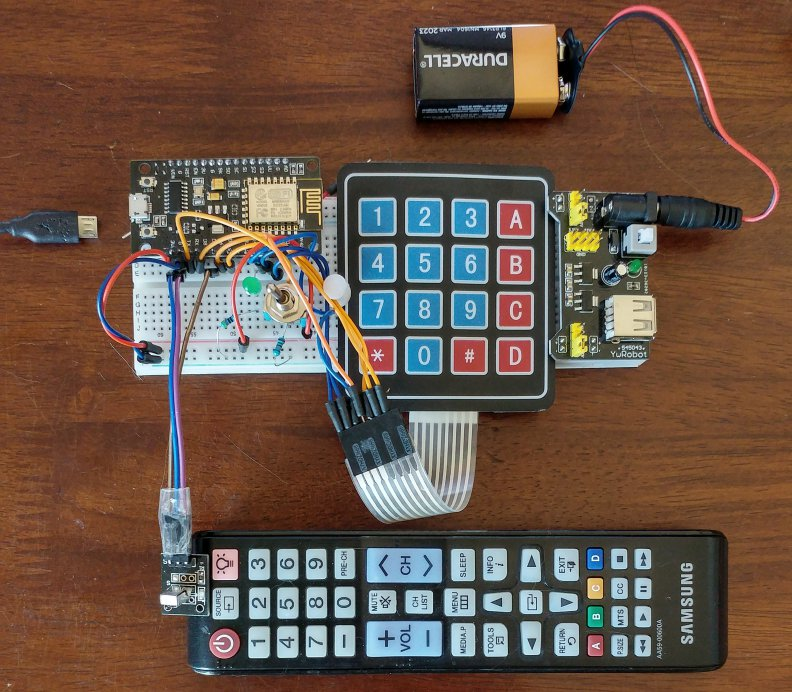

# Project: NodeMCU to Twilio Sync

[Repository link](https://github.com/tigerfarm/arduino/tree/master/samples/IrNodemcuHttpWsSync).

YouTube [demo video](https://www.youtube.com/watch?v=GTzOTd_wcsk).

What does the project do?
+ When a keypad key is pressed, the NodeMCU board sends an HTTP request with the keypress data to my Heroku web server application.
+ The web server application receives the data and sends a Sync document update HTTP request to Twilio.
+ Twilio send the update to clients that are subscribed to the project's document.
    The clients can be any where in the world, where there is an internet connection.

Data flow:
````
Keyboard >> NodeMCU >> WiFi router >> tfpdocroot.herokuapp.com >> Twilio Sync >> subscribed clients
````

The project is infrared enabled. Instead of pressing a key on the keypad, 
pressing 1-9 on my infrared remote controller will also cause the NodeMCU board to send an HTTP request with the keypress data.

The following example will post a “B” to the first position of Sync document named, “abc”, using the user identity, “browser”.

http://tfpdocroot.herokuapp.com/syncdocumentupdate?identity=browser&name=abc&position=1&value=B

+ To see the result, go to the following URL. You would need the password.
You would enter your identity, any string. Enter “abc” as the Document name. Click Get token. Click Get game & subscribe.
+ https://tfpdocroot.herokuapp.com/tigsync/docroot/index.html

Photo of the circuit.



--------------------------------------------------------------------------------
## My Development steps:

+ Install and test Arduino IDE with an Arduino board. Arduino Nano is my favorite.
+ Purchased and tested a NodeMCU:
ESP8266 ESP-12E NodeMCU Lua V3 CH340G WIFI Lua Wireless Development Board Module.
Bought through eBay. [Wikipedia NodeMCU info](https://en.wikipedia.org/wiki/NodeMCU).
+ Went through the Sync [Quickstart Guide](https://www.twilio.com/docs/sync/quickstart/js).
+ I enhanced the quickstart Tic Tac Toe (Tic Tac Sync) application with a new front end, and parameter options.
+ Enhanced the webserver application with an HTTP request API to make Sync document updates.
+ I deployed to Heroku.
+ I enhanced the sample NodeMCU HTTP GET program.
+ I created an HTTP GET request program to send a request to Twilio and receive a response.
+ I tested inputs on NodeMCU: button, infrared, and keypad.
+ Put together 9volt battery power supply system: converts to 3.3 volts which NodeMCU uses.
    This makes the device hand held and portable, no attached wires.
+ Created a program with all the components:
send HTTP GET request,
use button input to reset the Sync document game,
use infrared input and keypad input to set game squares.
+ Tuned and tested.

--------------------------------------------------------------------------------
### Future, test using MQTT with NodeMCU

https://www.instructables.com/id/NodeMCU-MQTT-Basic-Example/

In my IDE, using Tools/Manage libraries, I loaded the PubSubClient, by Nick O'Leary.

Arduino IDE–>File–>Example–>PubSubClient–>mqtt esp8266

--------------------------------------------------------------------------------
